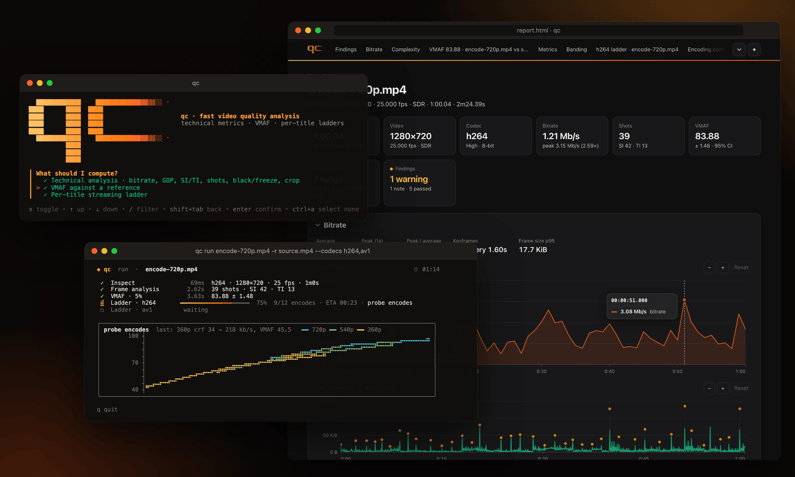

# qc - Video Quality Control

[](https://github.com/eko/qc/actions/workflows/ci.yml)
[](https://pkg.go.dev/github.com/eko/qc)
[](LICENSE)

**Fast, statistically honest video quality analysis**: a Go library and a CLI
that take a video and give you technical metrics, a VMAF score and a
per-title adaptive streaming ladder (H.264, HEVC, AV1) as fast as the
reliability you ask for allows.

<p align="center">
  
</p>

- **Technical analysis in seconds**: bitrate, peaks and GOP structure without
  decoding. Then one decode fanned out to SI/TI (ITU-T P.910), shot detection,
  black and frozen segments, letterbox/pillarbox and luma levels.
- **VMAF with a confidence interval**: short clips sampled across shots until
  the 95% interval is narrower than your target. The intervals really cover
  the truth 95% of the time, measured by replaying thousands of runs.
  `--exact` scores every frame, bit-exact with Netflix's `vmaf` tool, at 8 and
  10 bits. Or pick a fixed budget (`--sample 2%`, `--sample 1/scene`).
- **Beyond VMAF, on the same frames**: XPSNR (a pure-Go port matching
  ffmpeg's filter), CAMBI banding, PSNR, PSNR-HVS, SSIM, MS-SSIM, CIEDE2000
  or the whole AV2 CTC set, each with its own confidence interval, and VMAF
  per viewing device (phone, TV, 4K).
- **Per-title ladders, verified**: probe encodes of a representative digest,
  rate-quality curves per resolution, their upper envelope, rungs one
  just-noticeable difference apart, then a real encode of every rung. It lands
  on the exhaustive optimum (−0.04 VMAF, −0.7% bitrate on average) in a
  fraction of the time. Impose the shape (`--rungs 1080,720,540`), probe
  adaptively where the rungs are uncertain, add per-shot rungs, or let AV1
  synthesise film grain; verified rungs are checked for banding and for
  VMAF/XPSNR disagreements.
- **A terminal UI you'll enjoy**: a live dashboard with progress, ETA and
  panels that show VMAF converging and probes landing on a braille chart. There
  is also an interactive wizard, plus JSON and self-contained HTML reports.

## Install

**Docker** (linux/amd64, linux/arm64): qc, libvmaf 3.2.1 with its models and
ffmpeg with x264, x265 and SVT-AV1, nothing else to install. Mount your
videos on `/data`:

```sh
docker run --rm -v "$PWD:/data" ghcr.io/eko/qc vmaf reference.mov encode.mp4
docker run --rm -v "$PWD:/data" ghcr.io/eko/qc ladder source.mov -c av1 --html ladder.html
```

**Homebrew** (macOS, Linux):

```sh
brew install eko/tap/qc
```

**From source**: Go (see `go.mod`) with cgo, ffmpeg and ffprobe with
libx264, libx265 and libsvtav1, libvmaf ≥ 3.2.1 with its models and
pkg-config:

```sh
brew install ffmpeg libvmaf pkgconf   # macOS; Debian/Ubuntu: see docs/install.md
go install github.com/eko/qc/cmd/qc@latest
```

`qc version --check` checks the installation. Linux prerequisites, the image
contents and troubleshooting: [docs/install.md](docs/install.md).

## Quick start

```sh
qc                                                        # interactive wizard
qc run source.mov --codecs h264,av1 --html report.html    # analysis + ladders
qc run encode.mp4 -r source.mov                           # + VMAF against the source

qc analyze video.mp4 [--fast]                             # technical analysis (--fast: no decoding)
qc vmaf reference.mov distorted.mp4 [--exact]             # VMAF ± 95% CI, or every frame
qc vmaf reference.mov distorted.mp4 --sample 5%           # fixed budget (or 2/scene), one pass, CI reported
qc ladder source.mov -c av1 --encode-bit-depth 10         # per-title Main10 AV1 ladder
qc ladder source.mov --rungs 1080,720,540,360 --top-vmaf 93   # impose the rungs, bitrates computed
```

Every command accepts `-o report.json`, `--html report.html` and `-f json`.
See the [CLI reference](docs/cli.md).

## Performance

Apple M2 Max, real 1080p25 H.264 sources:

| Task | Exact / exhaustive | qc |
|---|---|---|
| VMAF of a 10:36 title (x264 720p rendition) | 147 s | ~30 s at ±0.5 (real 95% CI coverage: 94.5%) |
| H.264 ladder of a 10:36 title | ≈ 2 h (dense grid on the full title) | 1 min 39 s, every rung verified |
| H.264 ladder of a 1 min title vs the exhaustive optimum | 13 min | 2 min, −0.04 VMAF / −0.7% bitrate from the optimum |

How these numbers were obtained, and how to reproduce them on your own
content: [docs/validation.md](docs/validation.md).

## Documentation

- [Install](docs/install.md)
- [How it works](docs/README.md)
- [Architecture](docs/architecture.md)
- [Technical analysis](docs/analysis.md)
- [VMAF engine](docs/vmaf.md)
- [Ladder engine](docs/ladder.md)
- [Validation](docs/validation.md)
- [CLI](docs/cli.md)
- [NVIDIA GPUs](docs/gpu.md): NVDEC decoding, NVENC ladders and CUDA VMAF with `--gpu`
- [Innovation landscape and roadmap](docs/innovation.md): beyond VMAF

## Library

```go
dec := decode.NewFFmpeg("ffmpeg", 0) // decode.WithHWAccel(decode.HWAccelCUDA): NVDEC
analyzer := analysis.New(logger,
	probe.NewFFprobe("ffprobe"),
	bitstream.NewFFprobeReader("ffprobe"),
	dec,
	quality.NewMeter(dec, libvmaf.NewEngine()),
)

report, err := analyzer.Analyze(ctx, "video.mp4", analysis.Options{})
cmp, err := analyzer.Compare(ctx, "reference.mov", "encode.mp4", analysis.CompareOptions{})
ffmpeg := encode.NewFFmpeg("ffmpeg") // encodes, digests, grain measurements
engine := ladder.NewEngine(analyzer, ffmpeg, ffmpeg, ladder.WithGrainLab(ffmpeg))
res, err := engine.Build(ctx, "source.mov", ladder.Options{Codec: "av1"})
```

Every options struct has a useful zero value, except that `ladder.Options`
needs its `Codec`. To go further:

```go
cmp, err := analyzer.Compare(ctx, "reference.mov", "encode.mp4", analysis.CompareOptions{
	Quality: quality.Options{
		Precision: 0.25,                                         // or Exact: true, or Sample below
		Metrics:   []string{quality.MetricXPSNR, quality.MetricCAMBI},
		Devices:   []string{vmaf.DevicePhone, vmaf.Device4K},
	},
})
xpsnrY, _ := cmp.VMAF.Metric(quality.SeriesXPSNRY)  // mean and 95% CI, like VMAF
phone, _ := cmp.VMAF.Device(vmaf.DevicePhone)
banding := cmp.VMAF.Banding                         // segments where CAMBI > 5

// A fixed budget instead of a precision; the analysed encode gives its shot
// cuts to per-scene budgets and is not inspected again.
budget, _ := quality.ParseSample("2/scene")        // or "5%"
cmp, err = analyzer.Compare(ctx, "reference.mov", "encode.mp4", analysis.CompareOptions{
	Quality:   quality.Options{Sample: budget},
	Distorted: report,
})

// An imposed AV1 ladder, probed adaptively, with checked rungs.
res, err = engine.Build(ctx, "source.mov", ladder.Options{
	Codec:       "av1",
	Constraints: ladder.Constraints{Resolutions: []int{1080, 720, 540, 360}, TopVMAF: 93},
	Probing:     ladder.ProbingAdaptive,
	FilmGrain:   ladder.FilmGrainAuto,
	Metrics:     []string{quality.MetricXPSNR, quality.MetricCAMBI},
})
banded := ladder.BandedRungs(res.Rungs)        // rungs capped by banding
conflicts := ladder.RankConflicts(res.Rungs)   // VMAF and XPSNR disagree

// Per-shot rungs: one CRF per shot at an equal rate-quality slope.
res, err = engine.Build(ctx, "source.mov", ladder.Options{Codec: "hevc", PerShot: true})
for shot, cell := range res.ShotLadder(0) {    // the top rung, shot by shot
	fmt.Println(res.ShotInterval(shot).Start, cell.CRF, cell.PredictedBitrate)
}
if top := res.Rungs[0].PerShot; top != nil {
	fmt.Println(top.PooledBitrate(res.Shots))  // its bitrate over the whole title
}
```

On an NVIDIA GPU, check first: NVDEC falls back to the CPU by itself, but an
NVENC ladder would fail at its first encode. CUDA VMAF needs a binary built
with `-tags cuda` against a CUDA libvmaf (`libvmaf.CUDABuilt`), and a model
with CUDA features (VMAF v1, the default, has none):

```go
err = nvidia.Check(ctx, "ffmpeg", nvidia.Requirements{
	HWAccel: decode.HWAccelCUDA,   // the decoder's decode.WithHWAccel
	Codecs:  []string{"hevc"},     // ladders on NVENC
})
res, err = engine.Build(ctx, "source.mov", ladder.Options{
	Codec:   "hevc",
	Encoder: encode.HardwareNVENC, // no per-shot rungs nor film grain synthesis
	Backend: vmaf.BackendAuto,     // CUDA VMAF when the model and the build allow it
})
fmt.Println(cmp.VMAF.GPUSummary()) // e.g. "NVDEC decoding (cuda) · VMAF features on CUDA"
```

`quality/xpsnr` also works on its own, on decoded frames, and matches
ffmpeg's `xpsnr` filter. Runnable examples are on
[pkg.go.dev](https://pkg.go.dev/github.com/eko/qc) for `analysis`,
`quality`, `quality/xpsnr`, `ladder`, `pipeline`, `nvidia` and
`vmaf/libvmaf`. To run everything with progress hooks, use
`pipeline.Runner` as described in
[docs/architecture.md](docs/architecture.md#library-usage).

## Contributing

Contributions are welcome. See [CONTRIBUTING.md](CONTRIBUTING.md): `make check`
runs what CI runs, and changes to the sampler or the ladder engine come with
their validation numbers.

## License

[MIT](LICENSE)
