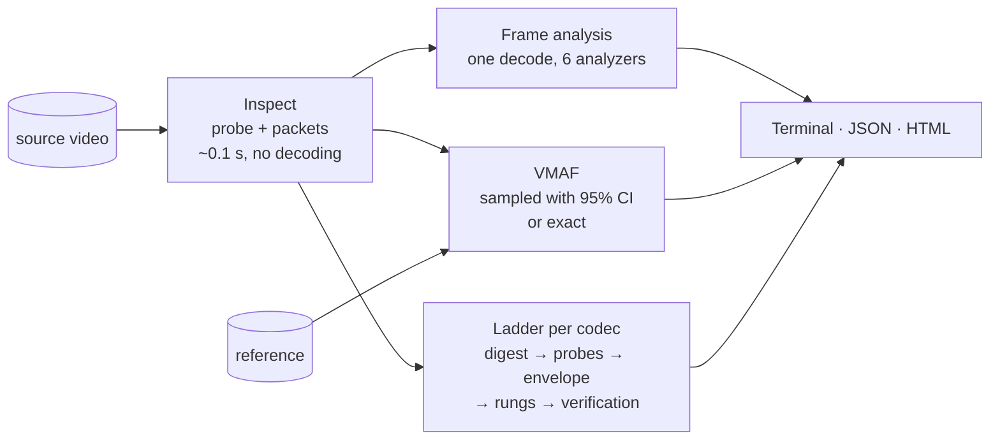

# qc documentation

qc analyses a video as fast as the requested reliability allows:
technical metrics, VMAF and per-title adaptive streaming ladders. Every
shortcut it takes is measured against ground truth, and every estimate that
is not exact comes with its uncertainty.

| Document | Contents |
|---|---|
| [Architecture](architecture.md) | Packages, data flow, concurrency, external tools, library usage |
| [Technical analysis](analysis.md) | Probe, bitstream analysis without decoding, single-decode fan-out, SI/TI, shots, black/freeze, crop, luma levels |
| [VMAF engine](vmaf.md) | libvmaf binding, stratified sampling with honest confidence intervals, decoding plans, 10-bit |
| [HDR](hdr.md) | HDR10/PQ/HLG detection and signalling checks, MaxCLL/MaxFALL, wPSNR and ΔE ITP, VMAF on HDR, HDR ladders |
| [Ladder engine](ladder.md) | Digest, probe encodes, rate-quality curves, envelope, rung selection, VBV, verification and calibration |
| [Validation](validation.md) | How speed-ups are proven: replay simulation, exhaustive ladder optimum, measured results |
| [CLI](cli.md) | Commands, flags, live dashboard, wizard, JSON and HTML reports |
| [NVIDIA GPUs](gpu.md) | NVDEC decoding, NVENC ladders, CUDA VMAF: what runs where, the CUDA image, the validation kit |

The landscape beyond VMAF (newer metrics, per-shot and network-aware
encoding, AI models) and the proposed roadmap are in
[innovation.md](innovation.md).

## At a glance

Reference numbers on an Apple M2 Max, 1080p25 H.264 sources:

| Task | Exact / exhaustive | qc |
|---|---|---|
| VMAF, 10:36 title (x264 720p rendition) | 147 s | ~30 s at ±0.5 (95% CI coverage measured at 94.5%) |
| H.264 ladder, 10:36 title | ≈ 2 h (dense grid on the full title) | 1 min 39 s, every rung verified |
| H.264 ladder, 1 min title, vs exhaustive optimum | 13 min | 2 min, mean −0.04 VMAF / −0.7% bitrate from the optimum |
