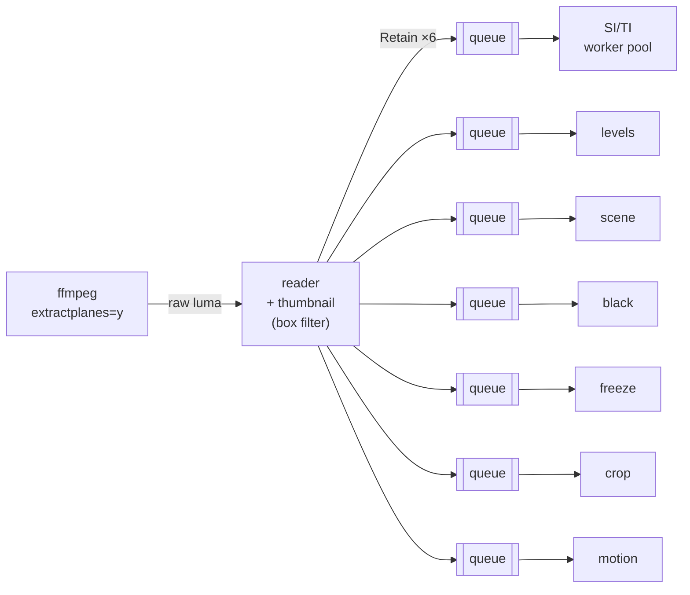
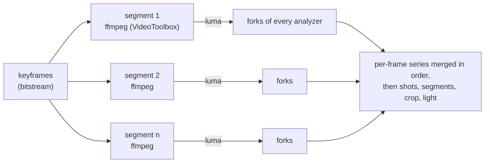

# Technical analysis

`qc analyze` (and the first stages of `qc run`) run in two steps:

1. **Inspection**, without decoding: container and stream metadata plus a pass
   over the compressed packets. It takes ~0.1 s, whatever the file length.
2. **Frame analysis**: the video is decoded once, every frame going to
   seven analyzers (eight for HDR): in a single pass fanned out to the
   analyzers, or, with hardware decoding, in concurrent segments
   ([segments](#segments-and-hardware-decoding)). Meanwhile, every audio
   track is decoded and measured: loudness against a target and defects
   ([audio](audio.md)).

## 1. Inspection

### Probe (`probe`)

`ffprobe -show_format -show_streams` gives the container, streams, codecs,
profiles, frame rates, bit depth and colour description. Attached pictures
(cover art) are ignored. When a container only declares the nominal frame rate
(NUT, raw streams) it is used as the average rate.

**Dynamic range** is classified from stream side data and the transfer
characteristic. For PQ, HLG and Dolby Vision streams only, a second
`ffprobe` call reads the side data of the first frame, where HDR10 metadata
often is (HEVC SEI or AV1 metadata OBUs in MP4) and HDR10+ always is. When
a frame analysis or a measurement follows, it runs meanwhile instead of
before (see [hdr.md](hdr.md#1-detection-and-signalling)):

| Signal | Classification |
|---|---|
| Dolby Vision configuration record | `DolbyVision` (profile, level, RPU/EL/BL flags, compatibility id) |
| `arib-std-b67` transfer | `HLG` |
| `smpte2084` transfer + ST 2094-40 dynamic metadata | `HDR10+` |
| `smpte2084` transfer + mastering display metadata | `HDR10` (with MaxCLL/MaxFALL when present) |
| `smpte2084` transfer only | `PQ` |
| otherwise | `SDR` |

The mastering display keeps its primaries and white point. HDR signalling
checks (BT.2020 primaries and matrix, 10 bits, narrow range, HDR10
metadata) are listed in [hdr.md](hdr.md#1-detection-and-signalling).

### Bitstream (`bitstream`)

`ffprobe -select_streams v:0 -show_entries packet=pts_time,dts_time,duration_time,size,flags`
lists every packet of the video stream. Only the demuxer runs, so this reads at
disk speed (0.24 s for a 1.1 GB file). Packets are sorted by presentation time,
and from them:

- **Average bitrate**: total bytes × 8 / duration.
- **Bitrate series**: bytes per bucket (default 1 s) of presentation time. The
  last bucket is normalised by its real length so a partial second is not
  under-reported.
- **Peak bitrate**: maximum over a sliding window (default 1 s) anchored on
  every packet, found in O(n) with two pointers. Its position is reported, as
  is the peak/average ratio (the HLS authoring spec asks for ≤ 2 for VOD).
- **Frame sizes**: min, max, mean, p50, p95 (nearest rank).
- **GOP structure**: keyframe positions and interval min/mean/max. A GOP is
  *fixed* when every interval is within 1.5 frame durations of the mean.
- Per-frame columns (PTS, size, keyframe flag) in presentation order, reused
  by later stages to timestamp decoded frames.

## 2. Frame analysis

The decoder pipes **8-bit luma only** (for PQ and HLG videos, a small grid
of 10-bit samples on a second pipe, see
[light levels](#light-levels-analyzelight-hdr-only)). `extractplanes=y` copies the Y samples
untouched (`format=gray` would stretch limited range 16–235 to 0–255 and break
the black and crop detectors); sources with more than 8 bits are reduced to 8
bits. Each frame also gets a **thumbnail**: the luma box-filtered by the
smallest integer factor that brings its width to ≤ 240 pixels (240×135 for
1080p). It is computed once and shared by the cheap analyzers.

Each analyzer has its own bounded queue (8 frames). A slow analyzer slows the
decoder down instead of growing memory. A failing analyzer stops the run, but
its queue keeps being drained so the decoder never blocks on a dead consumer.

Nominal black and white levels come from the colour range: limited (`tv`,
also the default when the range is not signalled) is 16/235, full (`pc`) is
0/255.

### Segments and hardware decoding

A single ffmpeg decode runs at ~680 fps on this machine's twelve cores for a
1080p25 H.264 title at 26 Mbit/s (M2 Max), and uses all of them. Apple's
hardware decoder is not faster per session, ~210 fps, because ffmpeg waits
for every frame, but its sessions add up and use almost no CPU: twelve reach
~1 400 fps, the throughput of the M2 Max's decoding engine. So on macOS the
frame analysis splits the video into segments decoded concurrently by
VideoToolbox (`--hwaccel auto`, the default):

- **Plan.** The segments start at keyframes (from the packet pass),
  three per decoder so that the last ones are short, at least 500 frames
  each (a shorter video is analysed in one pass). There are as many
  decoders as VideoToolbox sessions (`decode.SegmentDecoders`), one per
  core: twelve on an M2 Max. Each ffmpeg seeks to its segment (from the
  keyframe before it: up to one GOP decoded and dropped, 2.6% more frames on
  a 59-minute title) and outputs one frame more than it holds, the first
  frame of the next segment.
- **Forks.** Every analyzer is split into forks (`analyze.Forker`), one per
  segment, fed in order by the segment's goroutine, which also reads the
  frames and builds their thumbnails. A fork measures a frame against its
  predecessor (TI, shot scores, frozen frames, motion) only from the second
  frame of its segment on, like a single pass from the second frame of the
  video: thanks to the shared frame, every such measure is taken once, by
  the segment holding both frames. Per-frame values are merged in frame order
  (`analyze.Series`, the earlier segment winning on the shared frame), and
  shots, black and frozen segments, crop and light levels are computed from
  the merged series exactly as from a single pass: **the report is the
  same, to the bit**.
- **Seeks.** A segment seeks to the timestamp of its first frame on the
  container's timeline: the timestamp of the video's first frame
  (`bitstream.Report.Start`) plus the frame's, with `-seek_timestamp 1`.
  Without it, ffmpeg counts `-ss` from the start of the container, that of
  its earliest stream: in a video starting after its audio (a
  concatenation whose first video frame is at 0.04 s and audio at 0), every
  segment started one frame early, and the analysis of a 59-minute title
  fell back to a single pass (244 s instead of 65 s). A container starting
  before 0 (AAC priming kept by Matroska) would land early the same way.
- **Checks.** A segment yielding fewer frames than planned, or not starting
  with the frame the previous one ended with (CRC32 of the luma), means a
  seek did not land where planned (unusual timestamps): the analysis then
  starts over in one pass, with a warning (`segmented frame analysis
  failed, analysing in one pass`, shown at the default log level).
- **Exactness of the decoder.** VideoToolbox only decodes H.264 and HEVC,
  whose decoding is bit-exact by specification and which every Apple silicon
  Mac decodes in hardware, in the 4:2:0 8 or 10-bit formats it outputs as
  they are; ffmpeg downloads each
  frame and the filter graph is a CPU decode's (for the HDR sample grid,
  after an exact conversion to planar 10-bit). The frames are identical to
  a CPU decode (frame hashes checked on 8-bit H.264 and 10-bit HEVC).
  Other codecs, and a VideoToolbox failure before the first frame, decode on
  the CPU. VMAF measurements decode with VideoToolbox too, in concurrent
  runs ([vmaf.md](vmaf.md#hardware-decoding)); the other decodes (ladders)
  stay on the CPU with `auto`: a single VideoToolbox session is slower than
  ffmpeg's CPU decoder.

An analyzer that cannot be forked keeps the analysis in a single pass.
Without VideoToolbox (other systems, `--hwaccel none`, other codecs) the
analysis also stays a single pass: ffmpeg's multithreaded decoder already keeps
every core busy, and segments would only add the GOP each one decodes before
its first frame.

The luma crosses from ffmpeg through a Unix socket with a 1 MiB buffer
rather than a pipe (64 KiB per system call): 9% more frames per second on
the segmented analysis. The per-frame loops (Sobel and square roots of SI,
TI, luma statistics, thumbnails) have NEON versions on arm64, checked
bit-for-bit against the portable Go loops.

### Performance

Apple M2 Max (8 performance and 4 efficiency cores), ffmpeg 9.0, real
1080p25 H.264 titles; the 59-minute ones are a 10:36 title concatenated
six times without re-encoding, at its 26 Mbit/s and re-encoded at 6 Mbit/s.
Whole `qc analyze` (inspection, frame analysis, report; after, with the
camera motion analysis, which did not exist before), on the same machine
with other work running (hence the ranges; the fastest runs are those of an
otherwise idle machine):

| Title | Before | After | |
|---|---|---|---|
| 59 min, 26 Mbit/s (88 500 frames) | 225 s | 62–71 s | 3.4× |
| 59 min, 6 Mbit/s | 230 s | 49–52 s | 4.5× |
| 10:36, 26 Mbit/s | 44–50 s | 12–13 s | 3.6× |
| 10:36, 6 Mbit/s | 43 s | 11–12 s | 3.8× |
| 10 min synthetic (`testsrc2` + noise, 18 Mbit/s) | 44–46 s | 12–15 s | 3.3× |
| 2 min HDR10, HEVC Main10 | 12 s | 4 s | 3× |
| 1 min, 25 Mbit/s | 5.0 s | 3.0 s | 1.7× |
| `--hwaccel none` (single CPU pass): 10:36 at 26 / 6 Mbit/s, 2 min HDR10 | 44–50 / 43 / 12 s | 28 / 16 / 11 s | 1.7× / 2.7× / 1.1× |

Every report is identical to the one before, to the bit (JSON compared,
generation time and timings aside).

Where the time goes, per 1080p frame, in the segmented analysis of the
26 Mbit/s title:

- **Decoding.** VideoToolbox tops out at 1 400–1 500 fps on this title,
  however many sessions beyond twelve (~2 000 fps at 6 Mbit/s): at this
  bitrate the decoding engine is the limit, about 60 s for the 59-minute
  title, which the analysis reaches when the machine is otherwise idle. At
  6 Mbit/s the CPU is the limit. Downloading the frame, extracting and
  writing the luma costs ffmpeg ~2.6 ms of CPU per frame (half of it in the
  kernel).
- **Analysis.** ~2.1 ms of CPU per frame for the whole analysis: reading
  the luma from the socket ~0.7 ms, SI 0.65 ms (its square roots 0.4 ms),
  motion 0.2 ms, thumbnail 0.1 ms, TI 0.1 ms, luma statistics 0.06 ms,
  shots, black and freeze 0.05 ms. Before, the analysis cost ~8 ms of CPU
  per frame (SI 2.4 ms, luma levels 0.95 ms, TI 0.7 ms, thumbnail 0.6 ms,
  pipe reads 0.4 ms, goroutine hand-offs and wake-ups ~3 ms), on the cores
  the CPU decode needed too (~12 ms of CPU per frame at 26 Mbit/s): the
  whole ran at ~350 fps.
- **Levers that did not pay.** A CPU decode next to the VideoToolbox
  sessions adds up to 19% of decoding throughput on an idle machine but
  nothing measurable when the analysis and other work use the cores, and
  its segments could then lag behind: it is not the default (more
  `VideoOptions.Decoders` than `decode.WithVideoToolboxSessions` does it). Segments decoded on the
  CPU alone are slower than a single multithreaded decode. `-avioflags
  direct`, `SO_RCVLOWAT` and non-blocking reads did not change the cost of
  moving the luma.

### SI / TI (`analyze/siti`) — ITU-T P.910

- **SI** is the standard deviation, over the frame, of the Sobel gradient
  magnitude √(gx² + gy²) of the luma, excluding the one-pixel border.
- **TI** is the standard deviation of the pixel difference with the previous
  frame (undefined for the first frame).
- Both are computed on the full-resolution luma, on the 8-bit code value
  scale. The representative value is the **mean**, as recommended by P.910
  (2023); min, p5, p50, p95 and max are also reported.
- Frames are independent, so they are processed by a pool of workers (or
  by the goroutine of each segment). Each job holds references to the
  current and previous frames. The sum of squared gradients is accumulated
  in integers, and only the magnitudes need a square root. The magnitudes
  of a row are summed in pixel order, rows in order: four rows are summed at
  once (each in its own vector lane on arm64) without reordering any
  addition, so SI does not depend on the implementation.
- Complexity hints: SI < 30 low, < 70 medium, otherwise high; TI < 8 low,
  < 25 medium, otherwise high. They are indicative, not normative.

ffmpeg's `siti` filter costs ~40× a decode. This implementation takes
0.7–1.1 ms of one core per 1080p frame on an M2 Max with its NEON loops
(the square roots are most of it), 3.4 ms with the portable ones.

SI/TI on a downscaled picture would be cheaper, but it is another measure:
on two 1080p titles, SI on a 2×2 box-filtered luma was 47% and 56% higher
on average (up to 93% on a frame) and TI 1% to 4% lower (up to 16%), and
twice that at 4×4. The deviation depends on the content, so no factor
corrects it: SI/TI stay on the full-resolution luma.

### Shots (`analyze/scene`)

The score of each frame is the mean absolute difference (0–255) between its
thumbnail and the previous one. Cuts are detected at the end, with an
**adaptive threshold**. Frame *i* is a cut when:

- its score ≥ 12 (absolute floor), and
- its score ≥ 3 × the mean of its 2 neighbours on each side, so fast motion,
  which raises every score, does not trigger cuts, and
- the previous cut is ≥ 0.5 s away.

Shots are reported with their time range and frame range, and then enriched
with their mean SI, mean TI (excluding the cut frame) and bitrate (the sizes of
their packets). The hardest shots drive the top of an encoding ladder.

### Black segments (`analyze/black`)

A thumbnail pixel is dark when its value is ≤ black + 10% of (white − black).
A frame is black when ≥ 98% of its pixels are dark, and runs of black frames
lasting ≥ 0.5 s are reported. These are ffmpeg `blackdetect`'s defaults, but
computed on the shared thumbnail.

### Frozen segments (`analyze/freeze`)

A frame is frozen when the mean absolute difference between its thumbnail and
the previous one is ≤ 0.3. Box filtering averages out codec noise, so a
tight threshold works. A frozen frame also marks its predecessor, which starts
the run. Runs lasting ≥ 2 s are reported (ffmpeg `freezedetect`'s default).

### Letterbox and pillarbox (`analyze/crop`)

One frame out of 10 is scanned on the **full-resolution** luma, from each
edge inwards. A line belongs to a border when:

- its mean is ≤ black + 10, and
- none of its pixels exceeds black + 42, so bright burnt-in subtitles in the
  bars are not cropped away.

Fully dark frames (fades, black inserts) are ignored. The content rectangle is
the **union** of the content boxes of every analysed frame, aligned on even
coordinates for 4:2:0.

### Luma levels (`analyze/levels`)

A 256-bin histogram of the full-resolution luma gives the mean, min, max and
the share of samples outside the nominal range (below black or above white),
per frame and summarised. A high out-of-range share on the worst frames is
reported as a finding.

### Light levels (`analyze/light`, HDR only)

For PQ and HLG videos, the single decode has two outputs: the 8-bit luma
the other analyzers read, exactly as for SDR, on stdout, and on a second
pipe a grid of 10-bit Y′CbCr samples point-sampled by ffmpeg (one point per
4×4 cell of pixels at 1080p, 8×8 at 2160p). A seventh analyzer measures
per frame the peak, the 99.9th percentile and the average display light
of max(R, G, B), in cd/m² (CTA-861.3): MaxCLL and MaxFALL, compared with
the signalled values. Averages exclude the black borders the crop detector
found. The method, its accuracy (MaxFALL within 0.4%, robust MaxCLL within
0.5% of a full-resolution computation) and why MaxCLL is reported as a
percentile on 4:2:0 video are in [hdr.md](hdr.md#2-light-levels-maxcll-maxfall).
It adds a few percent to the frame analysis of an HDR title; SDR videos
keep the luma-only decode.

### Camera motion (`analyze/motion`)

The global (camera) motion between consecutive frames is estimated on the
shared thumbnails, then every shot's camera work is classified: **static,
pan, tilt, zoom, tracking** (a travelling camera: tracking, dolly, crane),
**handheld** (no steady move, a jittering camera path), **mixed** (several
moves) or **unknown** (too few reliable frames), with a direction (the
camera's: a camera panning right moves the content left) and a shake
measure. It is on by default; `--no-motion` (`VideoOptions.SkipMotion`)
leaves it out.

**Resolution.** The thumbnail (240×135 for 1080p and 2160p, 213×120 for
720p) is the working image: a whip pan of a full width per second is 10
thumbnail pixels per frame at 25 fps, and texture at that scale (edges,
foliage, faces) matches reliably, while box filtering has already averaged
out grain and compression noise. The estimator works on it and on its half
(a two-level pyramid) and reaches about 0.05 thumbnail pixel on a steady
move, which is 0.4 pixel at 1080p: finer than the thumbnail's own pixel
thanks to the sub-pixel step below. No full-resolution pass is needed.

**Per frame** (≈ 165 µs of one core, allocation-free):

1. *Predictor*: the row and column sums of both frames (integral
   projections) are correlated, their mean removed so fades do not bias
   them; this finds a dominant translation in O(width + height) per shift
   (Ratakonda, ISCAS 1998, the classic predictor of digital stabilisers).
2. *Block vectors*: a grid of 8 × 5 blocks of 16 pixels (rows follow the
   aspect ratio) is matched. Flat blocks (sky, black bars) are skipped
   before any search. Each block tries three predictors at level 1 (zero,
   the projection shift, its left neighbour's vector, as in predictive
   zonal searches such as EPZS), searches ±2 pixels around the best (±4 at
   level 0), refines ±1 pixel at level 0 with the sum of absolute
   differences (brightness offset of the frame removed), then takes two
   **Lucas–Kanade** steps: a symmetric one
   (mean of both frames' gradients), then one on the previous block warped
   by the first (bilinear), reusing the structure tensor (Baker & Matthews,
   "Lucas-Kanade 20 years on", IJCV 2004). A single step overestimates
   sub-pixel motion by ~12% on thumbnails (central differences attenuate
   fine detail); the second brings it to ≤ 1% on zoom and roll. The
   tensor's smallest eigenvalue rejects edges (aperture problem) and flat
   blocks, and a best match worse than 12 grey levels on average rejects
   occlusions.
3. *Robust global model*: a similarity (translation, zoom, roll) is fitted
   to the vectors with **MSAC** (Torr & Zisserman, CVIU 2000) — hypotheses
   from pairs of distant blocks plus the median translation, truncated
   squared residuals at 0.5 pixel — then refined by least squares on its
   inliers. In complex numbers the displacement field of a similarity is
   linear, v(p) = t + z·p, so both the two-point solution and the fit are
   closed-form. Moving subjects are outliers, not camera motion. The
   tolerance is tight on purpose: at 1 pixel, a subject covering a third of
   the picture and moving 1.5 pixels was absorbed as a fake zoom.
4. *Confidence* (0–1): the inliers' share of the grid (full confidence at
   half of it) times their share of the matched blocks. Frames under 0.25
   (flat pictures, fades, cuts, competing motions) are ignored and
   interpolated from their neighbours.

**Per shot**, with the shots of the scene detector (the first frame of a
shot is compared with the previous shot and never trusted):

- The per-frame model becomes camera rates: **pan and tilt in % of the
  picture width per second** (positive right and up), **zoom in % of scale
  per second** (positive in), roll in degrees per second. Rates relative to
  the width and to time hold at any resolution and frame rate.
- The **camera move** is their moving average over 0.5 s. A frame moves
  when a component exceeds 2.5 %W/s (a pan crossing the frame in 40 s) or
  2 %/s of zoom; two components both above threshold and within a factor
  two of each other make it mixed.
- The **shake** is the high-frequency part of the camera path, as video
  stabilisers separate it (Grundmann et al., "Auto-directed video
  stabilization with robust L1 optimal camera paths", CVPR 2011): the path
  (running sum of the displacements) minus its local linear trend over
  0.5 s (≈ 2 Hz: handheld tremor and walking bounce are 2–10 Hz). A local
  line rather than a moving average keeps a steady pan jitter-free up to the
  shot's edges. The shot's shake is the **median** jitter over its frames
  (% of the width), counted only where the camera moves slower than
  40 %W/s: a whip pan, or a wipe transition the cut detector let through,
  is one burst the trend cannot follow, not shake. A shot is **shaky** from
  0.25% of the width (5 pixels at 1080p).
- Classification: fewer than 50% reliable frames → unknown; fewer than 30%
  moving frames → static; otherwise the move covering ≥ 60% of the moving
  frames (with its direction, or without when the camera goes back and
  forth), else mixed. A moving shot whose single-similarity misfit (75th
  percentile of the block residuals, relative to the motion) exceeds 0.3 on
  its moving frames is **tracking**: depth layers move at different speeds
  (parallax), which a pan or a zoom does not produce. A shaky shot without a
  steady move (static or mixed) is **handheld**; a shaky pan stays a pan,
  flagged shaky. The shot's confidence combines the share of reliable
  frames, their confidence and how clearly the class dominates.

The title summary gives each class's share of the duration and its shot
count, the shaky shots (also a finding, a note: shaky footage costs bits
and may call for stabilisation) and the share of reliable frames.

The analyzer is a `Forker`: segments decoded concurrently estimate their
runs of frames independently, and the classification waits for the whole
title. A frame's estimate depends on its frame pair only (no predictor
from the previous frame), so a split analysis gives exactly the sequential
result. Accuracy, real-content agreement and cost are in
[validation](validation.md#camera-motion).

**Limitations.** One global model per frame: when a subject covers most of
the textured area (a vehicle driving into the camera, a character against a
flat sky), its motion is taken for the camera's. A pure roll is not a class
(it counts as static unless other moves accompany it; the roll rate is
reported). A brief move followed by a long hold (under 30% of the frames)
is static. Shots whose "cut" is a wipe or dissolve the scene detector does
not split mix two framings. Tracking versus pan or zoom is a best-effort
parallax heuristic, and shake measured on animation reflects the virtual
camera.

## 3. Audio

While the frames are analysed, each audio track is decoded by an ffmpeg of
its own to 32-bit float samples and measured in pure Go: integrated
loudness, loudness range, true peak and momentary/short-term series (ITU-R
BS.1770-5, EBU Tech 3341/3342) checked against a target (`ebu`, `atsc`,
`streaming`... `--loudness-target`), and silence, muted channels,
clipping, DC offset and phase. It adds no wall time; `--no-audio` leaves it
out, `--fast --audio` adds it to an inspection. Definitions, thresholds,
validation and cost: [audio.md](audio.md).

## Report

The JSON report (`schemaVersion` 1) holds the summaries, plus per-frame series
stored as **columns** (`frames.pts`, `size`, `keyframe`, `si`, `ti`,
`sceneScore`, `lumaMean`, `lumaMin`, `lumaMax`, and for HDR `peakNits`,
`robustPeakNits`, `averageNits`, and unless `--no-motion` `motionPan`,
`motionTilt`, `motionZoom`, `motionRoll`, `motionShake`,
`motionConfidence`), the light levels in `video.light`, the camera work
summary in `video.motion` and each shot's in `video.shots[].camera`
(`class`, `direction`, `shaky`, `confidence`, mean `pan`, `tilt`, `zoom`,
`roll`, `moving` share, `shake`, `parallax`), and the audio in `audio`
(the target and one entry per track: loudness, its series every 100 ms,
compliance, defects; see [audio.md](audio.md#report)). Columns are compact
and ready to chart. All durations are in seconds.

To check these values on the picture, `--overlay annotated.mp4` writes a
copy of the video with each frame's values burnt in (timecode, bitrate,
shot, camera move, SI/TI, levels, light, flags):
[annotated videos](overlay.md).
