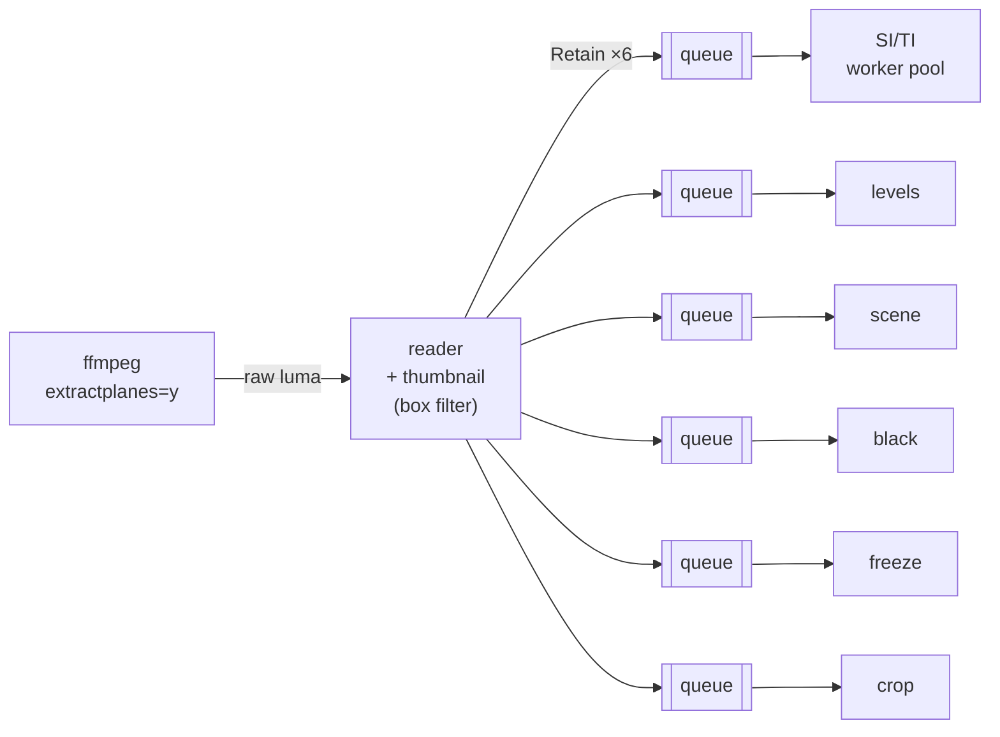

# Technical analysis

`qc analyze` (and the first stages of `qc run`) run in two steps:

1. **Inspection**, without decoding: container and stream metadata plus a pass
   over the compressed packets. It takes ~0.1 s, whatever the file length.
2. **Frame analysis**: the video is decoded once and every frame is fanned out
   to six analyzers running concurrently.

## 1. Inspection

### Probe (`probe`)

`ffprobe -show_format -show_streams` gives the container, streams, codecs,
profiles, frame rates, bit depth and colour description. Attached pictures
(cover art) are ignored. When a container only declares the nominal frame rate
(NUT, raw streams) it is used as the average rate.

**Dynamic range** is classified from stream side data and the transfer
characteristic. For PQ, HLG and Dolby Vision streams only, a second
`ffprobe` call reads the side data of the first frame, where HDR10 metadata
often is (HEVC SEI or AV1 metadata OBUs in MP4) and HDR10+ always is. When
a frame analysis or a measurement follows, it runs meanwhile instead of
before (see [hdr.md](hdr.md#1-detection-and-signalling)):

| Signal | Classification |
|---|---|
| Dolby Vision configuration record | `DolbyVision` (profile, level, RPU/EL/BL flags, compatibility id) |
| `arib-std-b67` transfer | `HLG` |
| `smpte2084` transfer + ST 2094-40 dynamic metadata | `HDR10+` |
| `smpte2084` transfer + mastering display metadata | `HDR10` (with MaxCLL/MaxFALL when present) |
| `smpte2084` transfer only | `PQ` |
| otherwise | `SDR` |

The mastering display keeps its primaries and white point. HDR signalling
checks (BT.2020 primaries and matrix, 10 bits, narrow range, HDR10
metadata) are listed in [hdr.md](hdr.md#1-detection-and-signalling).

### Bitstream (`bitstream`)

`ffprobe -select_streams v:0 -show_entries packet=pts_time,dts_time,duration_time,size,flags`
lists every packet of the video stream. Only the demuxer runs, so this reads at
disk speed (0.24 s for a 1.1 GB file). Packets are sorted by presentation time,
and from them:

- **Average bitrate**: total bytes × 8 / duration.
- **Bitrate series**: bytes per bucket (default 1 s) of presentation time. The
  last bucket is normalised by its real length so a partial second is not
  under-reported.
- **Peak bitrate**: maximum over a sliding window (default 1 s) anchored on
  every packet, found in O(n) with two pointers. Its position is reported, as
  is the peak/average ratio (the HLS authoring spec asks for ≤ 2 for VOD).
- **Frame sizes**: min, max, mean, p50, p95 (nearest rank).
- **GOP structure**: keyframe positions and interval min/mean/max. A GOP is
  *fixed* when every interval is within 1.5 frame durations of the mean.
- Per-frame columns (PTS, size, keyframe flag) in presentation order, reused
  by later stages to timestamp decoded frames.

## 2. Frame analysis

The decoder pipes **8-bit luma only** (for PQ and HLG videos, a small grid
of 10-bit samples on a second pipe, see
[light levels](#light-levels-analyzelight-hdr-only)). `extractplanes=y` copies the Y samples
untouched (`format=gray` would stretch limited range 16–235 to 0–255 and break
the black and crop detectors); sources with more than 8 bits are reduced to 8
bits. Each frame also gets a **thumbnail**: the luma box-filtered by the
smallest integer factor that brings its width to ≤ 240 pixels (240×135 for
1080p). It is computed once and shared by the cheap analyzers.

Each analyzer has its own bounded queue (8 frames). A slow analyzer slows the
decoder down instead of growing memory. A failing analyzer stops the run, but
its queue keeps being drained so the decoder never blocks on a dead consumer.

Nominal black and white levels come from the colour range: limited (`tv`,
also the default when the range is not signalled) is 16/235, full (`pc`) is
0/255.

### SI / TI (`analyze/siti`) — ITU-T P.910

- **SI** is the standard deviation, over the frame, of the Sobel gradient
  magnitude √(gx² + gy²) of the luma, excluding the one-pixel border.
- **TI** is the standard deviation of the pixel difference with the previous
  frame (undefined for the first frame).
- Both are computed on the full-resolution luma, on the 8-bit code value
  scale. The representative value is the **mean**, as recommended by P.910
  (2023); min, p5, p50, p95 and max are also reported.
- Frames are independent, so they are processed by a pool of workers. Each job
  holds references to the current and previous frames. The sum of squared
  gradients is accumulated in integers, and only the magnitudes need a square
  root.
- Complexity hints: SI < 30 low, < 70 medium, otherwise high; TI < 8 low,
  < 25 medium, otherwise high. They are indicative, not normative.

ffmpeg's `siti` filter costs ~40× a decode; this implementation keeps up with
decoding at 1080p.

### Shots (`analyze/scene`)

The score of each frame is the mean absolute difference (0–255) between its
thumbnail and the previous one. Cuts are detected at the end, with an
**adaptive threshold**. Frame *i* is a cut when:

- its score ≥ 12 (absolute floor), and
- its score ≥ 3 × the mean of its 2 neighbours on each side, so fast motion,
  which raises every score, does not trigger cuts, and
- the previous cut is ≥ 0.5 s away.

Shots are reported with their time range and frame range, and then enriched
with their mean SI, mean TI (excluding the cut frame) and bitrate (the sizes of
their packets). The hardest shots drive the top of an encoding ladder.

### Black segments (`analyze/black`)

A thumbnail pixel is dark when its value is ≤ black + 10% of (white − black).
A frame is black when ≥ 98% of its pixels are dark, and runs of black frames
lasting ≥ 0.5 s are reported. These are ffmpeg `blackdetect`'s defaults, but
computed on the shared thumbnail.

### Frozen segments (`analyze/freeze`)

A frame is frozen when the mean absolute difference between its thumbnail and
the previous one is ≤ 0.3. Box filtering averages out codec noise, so a
tight threshold works. A frozen frame also marks its predecessor, which starts
the run. Runs lasting ≥ 2 s are reported (ffmpeg `freezedetect`'s default).

### Letterbox and pillarbox (`analyze/crop`)

One frame out of 10 is scanned on the **full-resolution** luma, from each
edge inwards. A line belongs to a border when:

- its mean is ≤ black + 10, and
- none of its pixels exceeds black + 42, so bright burnt-in subtitles in the
  bars are not cropped away.

Fully dark frames (fades, black inserts) are ignored. The content rectangle is
the **union** of the content boxes of every analysed frame, aligned on even
coordinates for 4:2:0.

### Luma levels (`analyze/levels`)

A 256-bin histogram of the full-resolution luma gives the mean, min, max and
the share of samples outside the nominal range (below black or above white),
per frame and summarised. A high out-of-range share on the worst frames is
reported as a finding.

### Light levels (`analyze/light`, HDR only)

For PQ and HLG videos, the single decode has two outputs: the 8-bit luma
the other analyzers read, exactly as for SDR, on stdout, and on a second
pipe a grid of 10-bit Y′CbCr samples point-sampled by ffmpeg (one point per
4×4 cell of pixels at 1080p, 8×8 at 2160p). A seventh analyzer measures
per frame the peak, the 99.9th percentile and the average display light
of max(R, G, B), in cd/m² (CTA-861.3): MaxCLL and MaxFALL, compared with
the signalled values. Averages exclude the black borders the crop detector
found. The method, its accuracy (MaxFALL within 0.4%, robust MaxCLL within
0.5% of a full-resolution computation) and why MaxCLL is reported as a
percentile on 4:2:0 video are in [hdr.md](hdr.md#2-light-levels-maxcll-maxfall).
It adds a few percent to the frame analysis of an HDR title; SDR videos
keep the luma-only decode.

## Report

The JSON report (`schemaVersion` 1) holds the summaries, plus per-frame series
stored as **columns** (`frames.pts`, `size`, `keyframe`, `si`, `ti`,
`sceneScore`, `lumaMean`, `lumaMin`, `lumaMax`, and for HDR `peakNits`,
`robustPeakNits`, `averageNits`), the light levels in `video.light`. Columns are compact and ready
to chart. All durations are in seconds.
