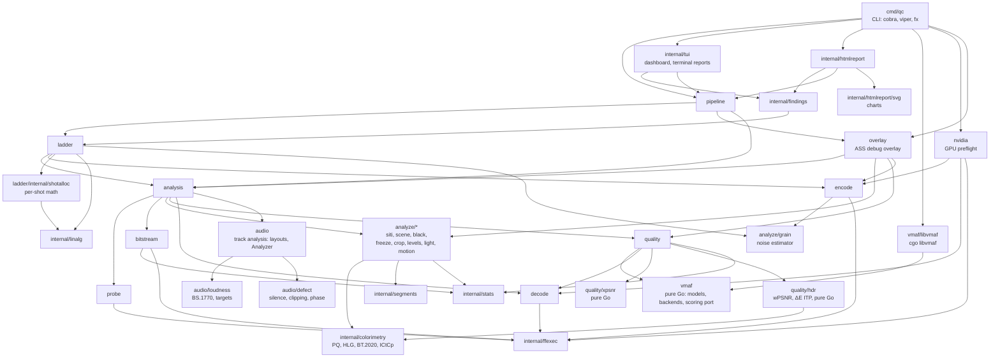

# Architecture

## Principles

1. **Decode as little as possible, and at most once.** Container and packet
   metadata answer many questions without decoding. When frames are needed, a
   single decode is fanned out to every consumer.
2. **Estimates carry their uncertainty.** Sampled measurements report a
   confidence interval, and the stopping rules are designed so that the
   interval is honest (validated by replay, see [validation](validation.md)).
3. **Exact paths stay available** (`--exact`) and are bit-exact with the
   reference tools, so every shortcut can be checked.
4. **Heavy lifting stays in proven native code** — ffmpeg for demuxing,
   decoding, scaling and encoding; libvmaf for VMAF — orchestrated from Go.

## Packages



Every edge is an import (`go list -f '{{.Imports}}'`), minus the leaf domain
packages `media` and `frame`, which most packages import. `vmaf/libvmaf` is
the only cgo package: nothing but the CLI (the composition root) imports it,
so the service packages build without a C toolchain (`make nocgo`).

| Package | Role |
|---|---|
| `media` | Domain types: stream info, HDR metadata (dynamic range, mastering display, content light level, Dolby Vision, HDR10+), packets, `Duration` (JSON seconds), `Interval`, `Levels` |
| `frame` | Reference-counted frames, pooled by geometry; luma, optional 4:2:0 chroma, optional thumbnail, 8 or 16-bit samples, optional grid of 10-bit Y′CbCr samples (HDR light levels) |
| `probe` | Container and stream information through `ffprobe -show_format -show_streams`, and the first frame's HDR side data for PQ, HLG and Dolby Vision streams |
| `bitstream` | Packet-level analysis: bitrate series, sliding peak, frame sizes, GOP structure — no decoding |
| `decode` | `Source` interface; ffmpeg implementation piping raw planes (seek, frame selection, scaling), optionally decoding with NVDEC or VideoToolbox (`WithHWAccel`, reported through `HWAccelReporter` and `SegmentHWAccelReporter`; `SegmentDecoders` tells how many segments to decode at once); seeks on the container's timeline (`Request.Origin`); audio streams as 32-bit float samples (`DecodeAudio`) |
| `analyze` | Runners (`Run`: one decode fanned out; `RunSegments`: concurrent segments fed to analyzer forks, `Forker`, merged with `Series`) and the per-frame analyzers (`siti`, `scene`, `black`, `freeze`, `crop`, `levels`, `motion` (camera motion per frame, camera work per shot), and `light` for HDR: MaxCLL, MaxFALL); `analyze/analyzetest` checks that forks give a sequential pass's results |
| `analyze/grain` | Pure film grain (noise) estimator behind `encode.FFmpeg.Noise` and the ladder's grain checks |
| `analysis` | Orchestrates inspection, frame analysis and audio analysis (`Analyze`, the audio tracks decoded concurrently with the video) and comparisons (`Compare`, through its `Meter`) into reports |
| `audio` | The analysis of an audio track on planar float32 samples (`Analyzer`, `Track`): channel layouts and their BS.1770 weights, loudness and defects combined ([audio.md](audio.md)) |
| `audio/loudness` | Pure Go ITU-R BS.1770-5 meter: K-weighting, gated integrated loudness, momentary and short-term series, loudness range (EBU Tech 3342), true peak (4× oversampling); delivery targets (EBU R 128, ATSC A/85, streaming) |
| `audio/defect` | Pure Go defect detection: silence of the mix and of each channel, muted channels, clipping, DC offset, correlation and phase of channel pairs |
| `vmaf` | Pure Go: model and device resolution, extractors, backend resolution, and the scoring contract (`Models`, `Scorer`) |
| `vmaf/libvmaf` | cgo binding to libvmaf implementing that contract: several models and extra features (PSNR, PSNR-HVS, SSIM, MS-SSIM, CIEDE2000, CAMBI) per context; CUDA feature extraction behind the `cuda` build tag (`CUDABuilt`, `InitCUDA`). `Engine` plugs it into `quality.Meter` |
| `quality` | Quality measurement engine: stratified sampling, confidence intervals for VMAF and every extra metric, per-device VMAF, banding segments, decoding plans |
| `quality/xpsnr` | Pure-Go XPSNR, matching ffmpeg's `xpsnr` filter |
| `quality/hdr` | Pure-Go HDR metrics on decoded frames: wPSNR (JVET HDR CTC) and ΔE ITP (ITU-R BT.2124) |
| `encode` | Codec settings, one encoder family each (x264, x265, SVT-AV1, NVENC) behind `Codec` and its features (`Codec.Supports`), ffmpeg encoding, digest extraction, subtitle burns (`Burn`, libass) |
| `overlay` | The debug overlay of annotated videos: an ASS script written from a report and a comparison (`Write`, pure, frame-accurate timing, coalesced events), burnt into a copy by `Renderer` through its `Burner` port, in concurrent segments with a hardware encoder ([overlay.md](overlay.md)) |
| `ladder` | Per-title ladder engine: validation, then digest, grain, probe, selection, verification and per-shot stages |
| `ladder/internal/shotalloc` | Pure per-shot math: shot rate-quality models, their prediction from shot features, equal-slope allocation |
| `pipeline` | Chains every stage of a run and reports progress through hooks |
| `nvidia` | GPU preflight: what an ffmpeg binary and the machine can do on an NVIDIA GPU (NVDEC, NVENC, device), checked before any work (`Check`) |
| `internal/ffexec` | Runs ffmpeg and ffprobe: streamed stdout (and a second output for two-output decodes) through Unix sockets with large buffers, bounded stderr tail, cancellation |
| `internal/stats` | Summaries, percentiles and confidence intervals shared by the analyzers and the sampler |
| `internal/segments` | Merges per-frame flags into time segments (black, frozen) |
| `internal/colorimetry` | BT.2100 colour science as lookup tables: PQ and HLG transfer functions, BT.2020 Y′CbCr, ICtCp, for the light analyzer and the HDR metrics |
| `internal/linalg` | Small dense linear algebra (Gauss-Jordan solve and inverse, ridge regression) behind the curve fits and shot predictions |
| `internal/findings` | The rules turning a report into typed findings (banding, rank conflicts, calibrated rungs, letterboxing...) and the verdict they lead to (pass, attention, fail on a blocking finding), shared by the terminal and HTML presenters, which word them |
| `internal/tui` | Live dashboard (bubbletea), terminal charts, static terminal reports |
| `internal/htmlreport` | Self-contained HTML reports, one typed entry point per report (`RenderAnalysis`, `RenderComparison`, `RenderLadder`, `RenderRun`) |
| `internal/htmlreport/svg` | The charts of the HTML reports: static SVG readable without script, and their data for the page script (tooltips, zoom, legend toggles) |
| `internal/testutil` | Test helpers: tiny synthetic clips generated with ffmpeg's lavfi sources, fake ffmpeg binaries |
| `internal/audiotest` | Test signals: the conformance signals of EBU Tech 3341/3342 with their expected readings, programme-like audio, defects, float WAV files |
| `cmd/qc` | The CLI and its composition root |
| `bench/vmafsim`, `bench/ladderval`, `bench/motionval`, `bench/audioval`, `bench/gpuval` | Validation tools (`motionval`: camera motion against synthetic moves of known speed; `audioval`: the audio against the EBU conformance signals, synthetic defects and ffmpeg; `gpuval`: the GPU validation kit) |

### Ports

Services depend on small interfaces declared where they are consumed, and
adapters satisfy them; libraries are wired with constructor injection, so
importers are not forced into a DI container.

| Port | Consumer | Adapter |
|---|---|---|
| `probe.Prober` (optionally `analysis.HDRProber`) | `analysis` | `probe.FFprobe` |
| `bitstream.PacketReader` | `analysis` | `bitstream.FFprobeReader` |
| `decode.Source` (optionally `decode.HWAccelReporter`, and `analysis.AudioDecoder` for the audio) | `analysis`, `quality` | `decode.FFmpeg` |
| `vmaf.Models`, `vmaf.Scorer` | `quality` | `vmaf/libvmaf` |
| `quality.Engine` | `quality.Meter` | `libvmaf.Engine` |
| `analysis.Meter` | `analysis.Analyzer.Compare` | `quality.Meter` |
| `ladder.Inspector` | `ladder.Engine` | `analysis.Analyzer` |
| `ladder.Encoder` (encodes, chunked encodes), `ladder.Digester`, optional `ladder.GrainLab` (film grain synthesis, `WithGrainLab`) | `ladder.Engine` | `encode.FFmpeg` |
| `pipeline.Analyzer`, `pipeline.LadderBuilder` | `pipeline.Runner` | `analysis.Analyzer`, `ladder.Engine` |
| `overlay.Burner` | `overlay.Renderer` | `encode.FFmpeg` |
| `pipeline.Overlayer` (optional, `WithOverlayer`) | `pipeline.Runner` | `overlay.Renderer` |

### The CLI's composition root

`cmd/qc` wires these with `fx`, one application per command run
(`cmd/qc/wire.go`). Its module supplies each part of the configuration
(tools, output, GPU settings) separately and provides every adapter behind
the ports of its consumers (`fx.As`): the prober, packet reader and decoder,
`libvmaf.Engine` as `quality.Engine`, `quality.Meter` as `analysis.Meter`,
`analysis.Analyzer` as itself, `ladder.Inspector` and `pipeline.Analyzer`,
`encode.FFmpeg` as the three ladder ports and `overlay.Burner`,
`ladder.Engine` as `pipeline.LadderBuilder`, `overlay.Renderer` as
`pipeline.Overlayer`, and `pipeline.Runner`. The GPU preflight and the
check of ffmpeg's libass and overlay encoder (with `--overlay`) run as
`fx.Invoke`s while the application is built, so a missing GPU, libass or
hardware encoder fails before anything starts, and the CPU profile (`--cpuprofile`) is a lifecycle
hook around the run. fx logs through the command's logger at debug level
only.

The configuration is one struct of groups (`ToolsConfig`, `OutputConfig`,
`AnalysisConfig`, `QualityConfig`, `LadderConfig`, `RunConfig`,
`GPUConfig`, `OverlayConfig`), squashed so that keys stay the flag names. Flags win over
`QC_*` environment variables, which win over the `--config` file; both are
applied through the flag parsers, so an invalid value is reported with where
it came from.

## External tools

| Tool | Used for | Why not in Go |
|---|---|---|
| `ffprobe` | Stream info, packet lists | Container coverage; reading packets is metadata-only and runs at disk speed |
| `ffmpeg` | Decoding, scaling (bicubic), frame selection, encoding, digest extraction | Codec coverage and SIMD-optimised decoders |
| libvmaf ≥ 3.2.1 (cgo) | VMAF feature extraction and models | Reference implementation; results must match Netflix's tools bit for bit |

On an NVIDIA GPU (`--gpu`), ffmpeg also decodes with NVDEC and encodes with
NVENC, and libvmaf extracts the features of VMAF v0.6.1-family models with
CUDA; everything else stays on the CPU. See [gpu.md](gpu.md).

Subprocesses are driven by `internal/ffexec`, which streams stdout to a
consumer, keeps a bounded tail of stderr for error messages and kills the
process when the consumer fails or the context is cancelled.

## Frames and memory

Decoded frames travel through ffmpeg's stdout as raw planes (`rawvideo`).
Only what consumers need crosses the pipe:

- technical analyzers receive the **luma plane only** (`extractplanes=y`,
  which copies Y samples untouched — `format=gray` would stretch limited range
  to full range), a third of a 4:2:0 frame; for PQ and HLG videos, the same
  decode also writes a sparse grid of 10-bit samples for the light analyzer
  to a second pipe (file descriptor 3, `ffexec.StreamPair`)
  ([hdr.md](hdr.md#2-light-levels-maxcll-maxfall));
- VMAF receives full 4:2:0 frames, scaled by ffmpeg to the model resolution,
  in 8 or 10 bits.

The "pipes" are Unix socket pairs with 1 MiB buffers: a pipe moves at most
64 KiB per system call, and a 2 MB luma plane then costs dozens of wake-ups
on each side. Sockets move a 1080p luma plane with about a third less CPU
on both sides, and the segmented frame analysis runs 9% faster.

Frames come from a `frame.Pool` (`sync.Pool` per geometry) and are
reference-counted: a decoded frame is `Retain`ed once per consumer and returns
to the pool when the last consumer `Release`s it, so steady-state processing
does not allocate.

## Concurrency

- Independent stages run concurrently with `errgroup` (probe and packet
  reading, the two decoders of a comparison, the frame analysis and the
  decodes of the audio tracks).
- Every producer/consumer link is a **bounded channel**: a slow consumer
  applies backpressure to the decoder instead of letting frames pile up in
  memory (a bug caught during development: an unbounded queue grew to 11 GB
  on a 10-minute exact VMAF run).
- CPU is split explicitly: VMAF clips run on `NumCPU/2` workers with
  `NumCPU/workers` libvmaf threads each; ladder probes run two at a time; the
  frame analysis decodes up to `NumCPU` segments at once, each analysed by
  its own goroutine (a single-pass analysis runs SI/TI on a pool of
  `NumCPU` goroutines).
- The hot loops of the frame analysis (Sobel, SI's square roots, TI, luma
  statistics, thumbnails) have NEON versions on arm64 (`*_arm64.s`, with
  their encodings generated from the mnemonics in comments) next to the
  portable Go loops, which other architectures and the `purego` build tag
  use; tests check both give the same bits.

## Library usage

```go
dec := decode.NewFFmpeg("ffmpeg", 0)
analyzer := analysis.New(logger,
	probe.NewFFprobe("ffprobe"),
	bitstream.NewFFprobeReader("ffprobe"),
	dec,
	quality.NewMeter(dec, libvmaf.NewEngine()),
)

// One stage at a time.
report, err := analyzer.Analyze(ctx, "video.mp4", analysis.Options{})
cmp, err := analyzer.Compare(ctx, "reference.mov", "encode.mp4", analysis.CompareOptions{})
ffmpeg := encode.NewFFmpeg("ffmpeg")
engine := ladder.NewEngine(analyzer, ffmpeg, ffmpeg, ladder.WithGrainLab(ffmpeg))
res, err := engine.Build(ctx, "source.mov", ladder.Options{Codec: "av1"})

// Or everything, with progress hooks.
runner := pipeline.NewRunner(analyzer, engine)
rep, err := runner.Run(ctx, pipeline.Options{
	Source: "source.mov", Reference: "", Codecs: []string{"h264", "av1"},
}, pipeline.Hooks{
	Done:    func(stage int, r pipeline.StageResult) { /* r.Analysis, r.Comparison or r.Ladder */ },
	Quality: func(stage int, p quality.Progress) { /* running estimate */ },
	Ladder:  func(stage int, p ladder.Progress) { /* p.Probe / p.Rung when one completes */ },
})
```

The runner inspects the source once: the comparison receives it as
`CompareOptions.Distorted`, so it is not inspected again, and a per-scene
budget (`quality.Options.Sample`) takes its shot cuts as scene boundaries.
Library callers of `Compare` get the same by passing their own analysis
report. Each stage hands its typed result to `Hooks.Done`
(`pipeline.StageResult`), for presenters to word. To test an encode against
its mezzanine and build the ladders from the mezzanine in one run, set
`Source` to the encode, `Reference` and `LadderSource` to the mezzanine.

**Per-shot rungs.** `ladder.Options.PerShot` adds a per-shot version of
every rung (`Rung.PerShot`), and `PerShotResolution` (experimental) lets
shots pick their resolution too. `Result.Shots` are the shots of the title,
`Result.ShotLadder(rung)` iterates over one rung's allocation shot by shot
and `PerShot.PooledBitrate(res.Shots)` is its predicted bitrate over the
title:

```go
res, err := engine.Build(ctx, "source.mov", ladder.Options{Codec: "hevc", PerShot: true})
for i, rung := range res.Rungs {
	if rung.PerShot == nil {
		continue
	}
	fmt.Println(rung.Height, rung.PerShot.PooledBitrate(res.Shots))
	for shot, cell := range res.ShotLadder(i) {
		fmt.Println(res.ShotInterval(shot), cell.CRF, cell.PredictedBitrate, cell.PredictedVMAF)
	}
}
```

**NVIDIA GPUs.** The decoder takes `decode.WithHWAccel(decode.HWAccelCUDA)`
(NVDEC, identical frames) or `HWAccelCUDAScale` (GPU scaling, not
bit-exact); `quality.Options.Backend` and `ladder.Options.Backend` move
VMAF feature extraction to CUDA (`vmaf.BackendCUDA`, or `vmaf.BackendAuto`
to fall back to the CPU for models without CUDA features such as VMAF v1);
`ladder.Options.Encoder = encode.HardwareNVENC` encodes ladders with NVENC,
without per-shot rungs or film grain synthesis (`ladder.ErrHardwareEncoder`).
CUDA VMAF needs a binary built with `-tags cuda` against a libvmaf built
with CUDA (`libvmaf.CUDABuilt`, `libvmaf.InitCUDA`). Hardware decoding falls
back to the CPU by itself, NVENC does not: check the GPU before a long run
with package `nvidia`:

```go
err := nvidia.Check(ctx, "ffmpeg", nvidia.Requirements{
	HWAccel:  decode.HWAccelCUDA,
	Codecs:   []string{"h264", "av1"},
	BitDepth: 10,
})
var checkErr *nvidia.CheckError
if errors.As(err, &checkErr) && checkErr.Part == nvidia.PartEncoding {
	// no NVENC for these codecs on this GPU: build the ladders on the CPU
}

dec := decode.NewFFmpeg("ffmpeg", 0, decode.WithHWAccel(decode.HWAccelCUDA))
// ... analyzer and engine as above, then:
res, err := engine.Build(ctx, "source.mov", ladder.Options{
	Codec:   "av1",
	Encoder: encode.HardwareNVENC,
	Backend: vmaf.BackendAuto,
})
cmp, err := analyzer.Compare(ctx, "reference.mov", "encode.mp4", analysis.CompareOptions{
	Quality: quality.Options{Model: "vmaf_v0.6.1", Backend: vmaf.BackendAuto},
})
fmt.Println(cmp.VMAF.GPUSummary()) // what ran on the GPU, or why not (BackendNote)
```

The examples on pkg.go.dev show the rest: measurement options (extra
metrics, viewing devices, fixed budgets) in `analysis` and `quality`,
imposed, AV1, per-shot and NVENC ladders in `ladder`, the whole run with
hooks in `pipeline`, the GPU preflight in `nvidia`, and the libvmaf build in
`vmaf/libvmaf`.
