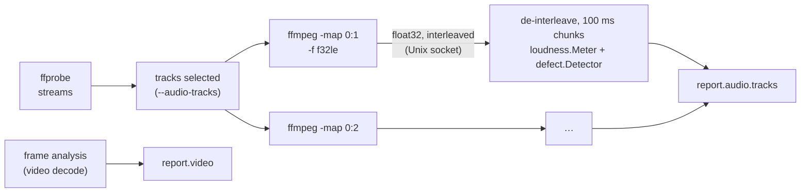

# Audio

`qc analyze` (and the analysis of `qc run`) checks the audio tracks while it
decodes the video: their **loudness** against a delivery target (ITU-R
BS.1770-5, EBU R 128, ATSC A/85) and their **technical defects** (silence,
muted channels, clipping, DC offset, phase). It runs next to the frame
analysis, one core per track, and adds no wall time to it
([cost](#performance)).

```sh
qc analyze title.mp4                              # every track, EBU R 128
qc analyze title.mp4 --loudness-target atsc       # ATSC A/85 (-24 LKFS ±2, -2 dBTP)
qc analyze title.mp4 --loudness-target -16        # a loudness of your own
qc analyze title.mp4 --audio-tracks default       # the default track only
qc analyze title.mp4 --fast --audio               # inspection + audio, no video decoding
qc analyze title.mp4 --no-audio                   # the picture only
```

## What is measured

| Measure | Definition | Reported as |
|---|---|---|
| Integrated loudness | BS.1770-5: K-weighted mean square of every channel, weighted (1 front and centre, 1.41 surround, LFE excluded), over 400 ms blocks overlapping by 75 %, gated at -70 LUFS then 10 LU below the mean of the blocks above it | LUFS (= LKFS), `loudness.integrated` |
| Loudness range (LRA) | EBU Tech 3342: 10th to 95th percentile of the 3 s short-term loudness taken every 100 ms, gated at -70 LUFS then 20 LU below their power mean | LU, `loudness.range` (`rangeLow`, `rangeHigh`) |
| True peak | BS.1770 Annex 2: 4× oversampling by the 48-tap interpolator of the Annex, never below the sample peak | dBTP, per channel and overall, with the time of the loudest 100 ms (`truePeak`, `truePeakAt`, `channelTruePeaks`) |
| Momentary, short-term | EBU Tech 3341: 400 ms and 3 s windows, every 100 ms; maxima over complete windows | LUFS series (`loudness.series`), `maxMomentary`, `maxShortTerm` |
| Sample peak | Largest absolute sample | dBFS, `samplePeak` |
| Silence | 10 ms windows whose samples all stay at or below the threshold (-60 dBFS), runs of at least 2 s; the whole mix (every channel), and each channel alone while the others play | intervals (`defects.silence`, `channels[].silence`), leading and trailing silence whatever their length |
| Muted channel | A channel silent 99 % of the time the mix plays | `channels[].muted` |
| Clipping | Runs of at least 3 consecutive samples at or above -0.01 dBFS (a 16-bit 32767 is -0.0003 dBFS); events 0.5 s apart merged into segments | samples, runs and segments per channel |
| DC offset | Mean of each channel | full scale 1 (`channels[].dc`) |
| Levels | RMS of each channel per 100 ms, and over the track | dBFS (a full-scale sine reads -3) |
| Phase | Correlation of each stereo pair (front, surround): Σlr / √(Σl² Σr²) over 400 ms windows every 100 ms, and over the track; out of phase when ≤ -0.5 for 1 s | series, segments, `inverted` when the whole track is ≤ -0.5 |
| Mono as stereo | Energy of L − R relative to the mean energy of L and R, ≤ -35 dB | `pairs[].difference`, `identical` |
| Format | Sample rate, coded bit depth (PCM, lossless), channel layout (signalled or assumed), start time | from ffprobe |
| A/V start offset | Audio stream start minus video stream start, on the container's timeline | `offset` (seconds): how the streams are placed, **not a lip-sync measurement** |

Every audio series has one value per 100 ms, the value `i` ending at
`start + (i + 1) × 0.1 s` on the container's timeline, the time axis of the
frame series: the HTML charts of audio and video share their axis and zoom
together. The windows of the first momentary (3 values) and short-term (29)
values reach before the first sample, which counts as silence, as ffmpeg's
`ebur128` filter shows them; the maxima and the loudness range use complete
windows only, as libebur128 does. Silence reads `-120` in loudness and level
fields (JSON has no infinity).

### Targets

`--loudness-target` (`analysis.AudioOptions.Target`, `loudness.ParseTarget`):

| Target | Integrated | Tolerance | True peak | Reference |
|---|---|---|---|---|
| `ebu` (default) | -23 LUFS | ±0.5 LU | ≤ -1 dBTP | EBU R 128 (2023), file-based delivery |
| `ebu-live` | -23 LUFS | ±1 LU | ≤ -1 dBTP | EBU R 128, live programmes |
| `atsc` | -24 LKFS | ±2 dB | ≤ -2 dBTP | ATSC A/85:2013 (CALM Act) |
| `streaming` | -16 LUFS | ±1 LU | ≤ -1 dBTP | the level of most streaming and podcast platforms |
| `streaming-14` | -14 LUFS | ±1 LU | ≤ -1 dBTP | the normalisation level of music streaming |
| a number (`-18`) | that loudness | ±1 LU | ≤ -1 dBTP | |

The report keeps the target (`audio.target`) and each track's compliance
(`compliance`: `deviation` in LU, `loudness` and `truePeak` pass or fail).
A silent track (nothing above -70 LUFS) fails the loudness check.

### Findings

| Finding | Level | When |
|---|---|---|
| Loudness off target | warning | deviation beyond the tolerance |
| True peak over the ceiling | warning | with the 100 ms passages over it |
| Meets the target | passed | both checks pass |
| Silent track | warning | nothing above -70 LUFS (replaces the others) |
| Silence | warning | mix silences inside the programme |
| Leading / trailing silence | note | a silence at the start or the end at least as long as the minimum |
| Channel silent while the others play | warning | front left and right, and every channel of a mono or unknown layout: a surround mix's centre, surrounds and LFE are often silent by design |
| Muted channel, empty centre (surround) | warning | |
| Empty LFE | note | many programmes carry no low-frequency effects |
| Clipping | warning | any clipped run |
| DC offset | warning | above -50 dBFS (0.32 % of full scale) |
| Inverted polarity, out of phase | warning | correlation of the track ≤ -0.5, or segments |
| Mono as stereo | note | often intended (mono dialogue) |
| Sample rate | note, warning under 32 kHz | other than 48 kHz, the rate of video and broadcast delivery |
| Bit depth | warning | PCM or lossless under 16 bits |
| Layout not signalled | note | the usual layout of the channel count is assumed (stereo, 5.1, 7.1), or channels `C1`, `C2`... |
| A/V start offset | note | streams starting 1 ms or more apart |

### Channel layouts

The channels are taken in stream order and named from ffprobe's
`channel_layout` (ffmpeg's names: `stereo`, `5.1`, `5.1(side)`, `7.1`...,
or `FL+FR+LFE`). The BS.1770-5 weight of a channel follows its position:
1.41 for surround channels 60° to 120° off centre (the side channels, and
the back channels of layouts without side channels, as in `5.1`, where
they stand at the surround positions), 0 for the LFE, 1 for the others,
the rear channels of 7.1 (135° to 150°) included. ffmpeg's `ebur128` filter
weights those rear channels 1.41 too: 7.1 readings may differ from it.

## How it runs



- **Decoding.** One ffmpeg per track (`decode.FFmpeg.DecodeAudio`) decodes
  it at its own rate to 32-bit float samples (full scale ±1) and writes
  them interleaved (ffmpeg's raw muxers take no planar format) through a
  Unix socket, as it does frames; Go de-interleaves them into planar
  chunks of 100 ms (0.7 ns per sample). ffmpeg only resamples when its
  decoder disagrees with the rate ffprobe reported.
- **Concurrently with the video.** `analysis.Analyzer.Analyze` starts the
  tracks' decodes with the frame analysis (an errgroup: the first error
  stops both). The audio analysis runs when the frames are analysed, not
  with `SkipVideo` (`--fast`, the ladder's inspections), unless
  `AudioOptions.WithInspection` (`--fast --audio`): `--fast` means no
  decoding. The ladders' per-shot analysis leaves it out.
- **Pure Go measurement** (`audio/loudness`, `audio/defect`, combined by
  `audio.Analyzer`): one pass, no allocation per sample. The meter keeps one
  weighted energy per 100 ms and computes every window, gate and
  percentile from them at the end, exactly as the standards define them;
  the K-weighting is two biquads in float64, their coefficients derived
  per rate from the analogue prototypes of the standard's 48 kHz ones (to
  1e-12 at 48 kHz); the true peak runs the Annex's four 12-tap phases on
  each sample.

### Why not ffmpeg's `ebur128` filter

ffmpeg measures the same loudness (`ebur128=peak=true`, or `loudnorm`), and
parsing its output would have been shorter to write. Measured on the
10:36 title (three stereo AAC tracks) and a 59-minute one, the Go meter
is:

- **Faster**: the whole audio analysis of the three tracks, decoding
  included and run concurrently, takes 1.5 s for 10:36 (7.6–8.0 s for 59 min),
  where `ebur128` alone takes 3.7–3.9 s (19.5–20.9 s) per track and `loudnorm`
  20–28 s (109–164 s): ffmpeg resamples the whole signal to 192 kHz for its
  true peak, where the Annex's polyphase filter only computes the four
  phases.
- **Complete**: the filters give a summary (with one decimal) or per-frame
  logs to parse; the series for the charts, the per-channel true peaks,
  the time of the peak and the defects (silence per channel, clipping,
  phase, DC) would need more filters and passes (`silencedetect`,
  `astats`, `aphasemeter`), each with its own conventions.
- **Testable and portable**: the conformance signals of EBU Tech 3341 and
  3342 run in unit tests in milliseconds, without ffmpeg, and the defect
  rules on synthetic buffers.

ffmpeg stays the reference it is checked against: within 0.01 LU and
0.01 dB of `ebur128` on real content ([validation](validation.md#audio)).

## Performance

Apple M2 Max, `qc analyze` of real 1080p25 H.264 titles at 26 Mbit/s with
three stereo AAC tracks (two of them silent), each command twice,
alternating, on a machine running other work:

| Title | Without audio (`--no-audio`) | With audio (3 tracks) | Added |
|---|---|---|---|
| 10:36 | 12.4–13.3 s wall, 73.5–74.1 s CPU | 12.4–12.5 s wall, 83.8–84.3 s CPU | no wall time, +10 s CPU (+14 %) |
| 59 min, segmented VideoToolbox decode | 63.2 s wall, 401 s CPU | 63.6 s wall, 456 s CPU | no wall time, +55 s CPU (+14 %) |
| 59 min, single CPU decode (a file whose segments do not seek cleanly) | 203.6–204.2 s wall, 1664–1665 s CPU | 201.1–204.1 s wall, 1722–1724 s CPU | no wall time, +58 s CPU (+3.5 %) |

(A second pair of the segmented runs, disturbed by other jobs, gave 81.3 s
and 88.2 s, 427 s and 486 s of CPU.)

**No added wall time**: the tracks are decoded while the video is, and
finish first. The CPU cost is about **1.8 ms per second of audio per stereo
track**, a tenth of a core for three tracks: ffmpeg's AAC decode and the
transfer, and the Go analysis, 1.3 ms per second of stereo audio
(`go test -bench . ./audio/... ./decode/`: loudness meter 1.08 ms, of which
true peak 0.67 ms and K-weighting 0.33 ms; defect detection 0.17 ms;
de-interleaving 0.07 ms). The true-peak loop is unrolled over the 12 taps
of each phase (6.7 ns per sample and channel, 1.3× faster than a loop over
the taps). A NEON kernel could reach ~1.5 ns, saving about 1 % of the frame
analysis's CPU on a three-track title: not worth an assembly kernel.

## Report

`report.audio` (absent without audio or with `--no-audio`): the `target`,
and per track in `tracks`: `stream` (ffprobe's index), `layout`,
`channels`, `layoutGuessed`, `start` and `offset`, `loudness` (the readings
above and their `series`: `momentary`, `shortTerm`, `truePeak` per 100 ms),
`compliance`, and `defects` (`duration`, `silence`, `leadingSilence`,
`trailingSilence`, `channels` with `peak`, `rms`, `dc`, `silent` share,
`muted`, `silence`, `clippedSamples`, `clipEvents`, `clipping`; `pairs` with
`correlation`, `difference`, `identical`, `inverted`, `outOfPhase` and their
correlation `series`; `levels`, the RMS of every channel per 100 ms).
`info.audio` gains `sampleFormat`, `bitDepth`, `startTime`, `duration` and
`default`, and each video stream its `startTime`. Every addition is
optional: reports without audio read as before.

- **Terminal**: an Audio block, one line per track (loudness ✓, ▲ too loud,
  ▼ too quiet; LRA; true peak ✓ or ▲; maxima) and its short-term loudness
  as a sparkline; the findings.
- **HTML**: a section per track: the short-term and momentary loudness with
  the target, its tolerance and the integrated loudness as lines; the RMS
  level of every channel with the true peaks over the ceiling as markers;
  the correlation of each pair. Silences, clipping and out-of-phase
  segments are shaded on the three charts and listed in a table whose
  times zoom every chart. Tooltips read the 100 ms values.
- **Annotated video**: the `loudness` item (`--overlay-items`, alias
  `audio`) shows the short-term and momentary loudness of the default
  track in the frame panel ([overlay.md](overlay.md)).

## Library

```go
report, err := analyzer.Analyze(ctx, "title.mp4", analysis.Options{
	Audio: analysis.AudioOptions{
		Target:       loudness.Targets()[2], // ATSC A/85, or loudness.ParseTarget("-16")
		DefaultTrack: true,                  // or Tracks: []int{0, 2}
		Defect:       defect.Options{SilenceThreshold: -50, SilenceDuration: media.Seconds(1)},
	},
})
for _, t := range report.Audio.Tracks {
	fmt.Println(t.Stream, t.Loudness.Integrated, t.Loudness.Range, t.Loudness.TruePeak, t.Compliance.OK())
}
```

The audio needs a decoder implementing `analysis.AudioDecoder`
(`decode.FFmpeg` does); with another `decode.Source` the analysis leaves it
out. `audio.NewAnalyzer`, `loudness.NewMeter` and `defect.New` work on
their own on planar float32 samples.

## Limitations

- **No lip-sync detection**: the offset compares the streams' start times;
  a delay inside the audio itself is not measured.
- **Dialogue gating** (ATSC A/85 Annex, some platform specifications) is
  not implemented: the integrated loudness is the full-programme one of
  BS.1770.
- **Clipping after lossy coding**: a clipped master coded to AAC decodes to
  waves that overshoot and wobble around full scale instead of flat runs;
  the runs detector finds part of it (a clipped passage of 0.5 s: 400
  clipped samples in PCM, 8–20 in AAC at 256 kb/s). A clipped PCM or
  lossless track is found reliably.
- Gaps in the audio timestamps are not filled: samples are taken in
  decoding order, so a track with missing packets drifts from the picture
  after the gap.
- The correlation reads 0 while a channel is silent; the phase windows are
  400 ms, so segments are placed within about 0.4 s.
- Streams of an audio-only file are not analysed (`qc analyze` needs a
  video stream); `bench/audioval` measures them directly.
- EBU cases 7, 8, 10, 11, 13, 14 and 20 to 23 are programme or recorded
  files, not synthesised ([validation](validation.md#audio)).
