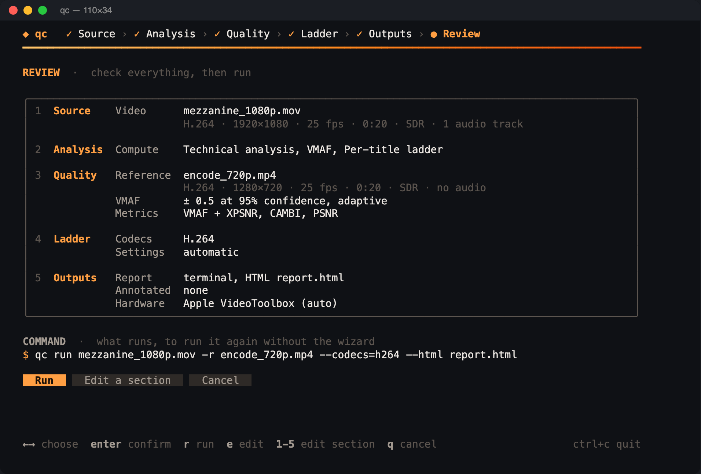
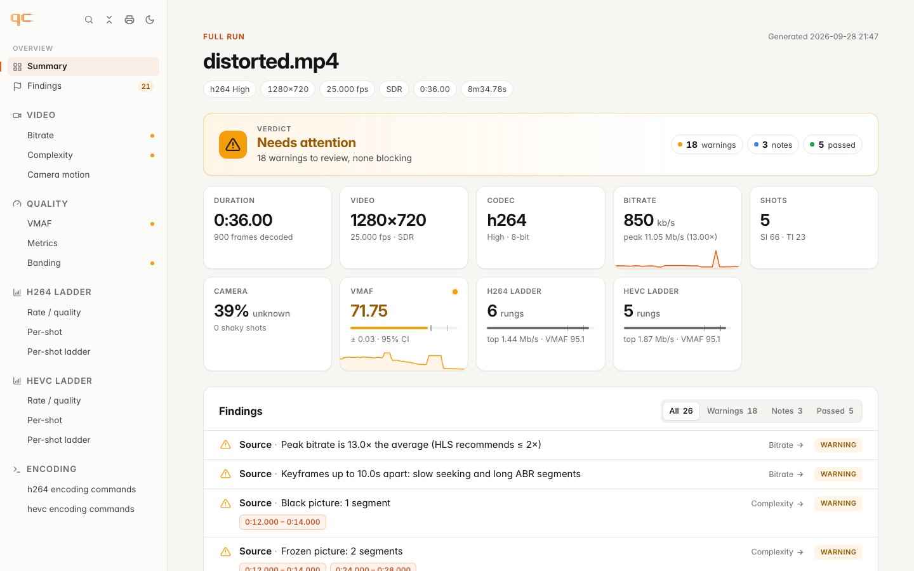
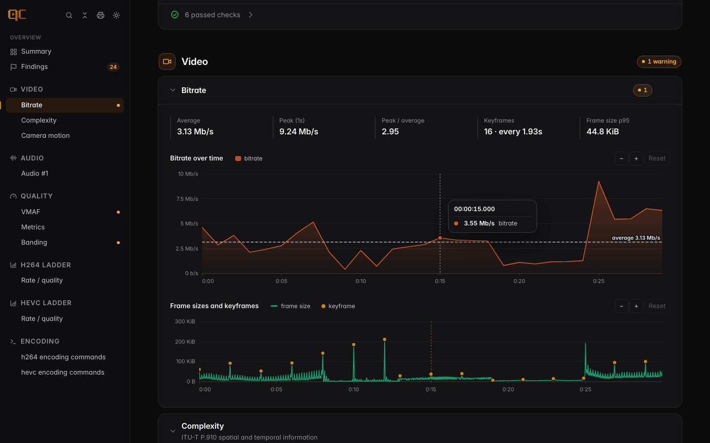

# CLI

```
qc                      interactive wizard (in a terminal)
qc run <source>         everything: analysis, VMAF (with -r), ladders
qc analyze <file>       technical analysis
qc vmaf <ref> <dist>    VMAF of dist against ref
qc ladder <source>      per-title ladder for one codec
qc version [--check]    versions of qc, Go and libvmaf; --check: the environment
```

Every flag can also be set through a `QC_` environment variable (dashes become
underscores): `QC_FFMPEG=/opt/ffmpeg/bin/ffmpeg`, `QC_PRECISION=0.25`, or in
a [configuration file](#configuration-file).

## Live dashboard

In a terminal, every command draws a live dashboard on stderr:

```
 ◆ qc  run  ·  source.mov                                                 ⏱ 01:12

  ✓  Inspect               120ms  h264 · 1920×1080 · 25 fps · 10m36s
  ✓  Frame analysis          34s  212 shots · SI 38 · TI 11
  ⣷  Ladder · h264       ━━━━━━━━━━━━━━━━━━━━━━  73%  11/15 encodes · ETA 00:14 · probe encodes
  ○  Ladder · av1         waiting

 ╭──────────────────────────────────────────────────────────────────────────╮
 │ probe encodes  last: 360p crf 27 → 360 kb/s, VMAF 64.1   ━━ 1080p ━━ 720p │
 │        100 ┤                                        ⢀⣀⣀⣀⣀⣤⠤⠤⠤⠖⠒⠒⠋⠉⠉      │
 │            ┤                     ⣀⣀⣤⠤⠴⠒⠒⠋⠉⠉                            │
 │         60 ┤     ⣀⣀⡤⠴⠒⠚⠉⠉                                               │
 ╰──────────────────────────────────────────────────────────────────────────╯
 q quit
```

- Each stage shows a spinner, a gradient progress bar, a counter (frames or
  encodes), a rate and an ETA.
- The running stage has a live panel:
  - **VMAF**: the running estimate and its confidence interval on a 0–100
    gauge, updated after each sampling round;
  - **ladder probes**: every probe encode lands on a braille rate-quality
    chart, one colour per resolution;
  - **ladder verification**: predicted vs measured quality of each rung as it
    is verified.
- `q`, `esc` or `ctrl+c` cancel the run (the context is cancelled and
  subprocesses are killed).
- Without a terminal (pipes, CI), or in a background job (`qc run … &`,
  `brew test`), nothing is drawn and output stays clean.

Charts use braille characters (2×4 dots per cell) and bars use `━`: both are
single-width, so layouts stay aligned in every terminal.

## Wizard

`qc` without arguments, in a terminal, opens a full-screen wizard:

<p align="center"></p>

A step indicator runs across the top (**Source › Analysis › Quality ›
Ladder › Outputs › Review**, with a progress rail); sections that the answers
make irrelevant are skipped and shown as such. On terminals of 124 columns
and more, a summary of the answers given so far sits beside the form.

1. **Source**: browse folders for the video. Type to filter, `enter` opens a
   folder or picks a file, `←` goes up. Only video files are listed; the
   highlighted one is described by a quick ffprobe (codec, resolution, frame
   rate, bit depth, duration, SDR or HDR format, audio tracks, size). A file
   ffprobe cannot read, or without a video stream, cannot be picked;
2. **Analysis**: what to compute: technical analysis, VMAF against a
   reference, streaming ladder;
3. **Quality**, for VMAF: the reference (browsed from the folder of the
   source), then the **VMAF mode**: a target precision (± VMAF, adaptive,
   the default), a fixed budget as a share of the frames (5% by default) or
   as clips per scene (2 by default), or exact scoring, each followed by its
   value; then the **metrics** to measure next to VMAF, ticked one by one
   with their CPU cost (defaults pre-ticked: XPSNR, CAMBI, PSNR; untick
   everything for VMAF only), and optional **per-device VMAF** (phone, TV,
   4K). The metrics are also asked for ladders: the verified rungs get the
   same metrics. When the picked video (or the reference) is HDR, how VMAF
   scores it: on the HDR signal or on an SDR tone mapping (`--hdr-metric`),
   with the detected format (HDR10, HLG…) in the question;
4. **Ladder**: the codecs and the digest the ladder is estimated on
   (balanced on the title, its most complex scenes, or evenly spaced:
   `--digest`), then optionally **customise the ladder**:
   - shape: automatic, a number of rungs, or one rung per listed resolution;
   - top and minimum VMAF;
   - bitrate cap (kb/s), encoder preset, 8 or 10-bit, verification on or off,
     probe placement, per-shot rungs, and AV1 film grain synthesis;
5. **Outputs**: when an NVIDIA GPU is usable with the ffmpeg in use
   (`QC_FFMPEG`, the `QC_CONFIG` file or `PATH`; see [GPU](#nvidia-gpu)),
   whether to use it (`--gpu`); optionally an HTML report; when a ladder is
   built, whether to encode it and where (`--encode-ladder`); and last, when the
   source is analysed or compared, whether to produce an annotated video, and
   where (`--overlay`, see [annotated videos](overlay.md));
6. **Review**: every answer, section by section, with the metadata of the
   videos and the hardware the run uses (the NVIDIA GPU with `--gpu`, Apple
   VideoToolbox on macOS, the CPU elsewhere), and the exact equivalent `qc run`
   command (wrapped with `\` continuations, so it can be copied as it is).
   **Run** (`enter` or `r`), **Edit a section** (`e`, or its number `1`–`5`:
   the section is asked again, with the pages the change calls for, such as
   the reference when VMAF is added) or **Cancel** (`q`).

Keys are shown at the bottom of every page. `esc` goes back a page (or
clears a filter), `shift+tab` back a field, `ctrl+c` quits at any time. The
wizard adapts to light and dark terminals and to their size (80×24 and
more; smaller terminals are asked to grow). Without colours (`NO_COLOR`, or
`TERM=dumb`) or without a UTF-8 locale it draws in ASCII, with brackets
around what is focused. With `ACCESSIBLE=1` (or `TERM=dumb`) it asks plain,
numbered prompts that screen readers can follow, skips the questions that do
not apply, and ends with the same review and choices. The light that sweeps
across the logo at launch (under half a second) stays off without colours, in
the accessible mode, or with `QC_NO_ANIMATION=1`.

Once run is chosen, the wizard prints the equivalent command, only with the
options that differ from the defaults, and runs exactly that command with
the dashboard.

## Flags

### Output (every command)

| Flag | Meaning |
|---|---|
| `-f, --format text\|json` | stdout format (default text) |
| `-o, --output file.json` | also write the full JSON report |
| `--html file.html` | also write a self-contained, interactive HTML report (see [Reports](#reports)) |
| `--ffmpeg`, `--ffprobe` | binaries (default from `PATH`) |
| `--log-level` | debug, info, warn, error |
| `--config file` | [configuration file](#configuration-file) (YAML, TOML or JSON; also `QC_CONFIG`) |

### Configuration file

`--config qc.yaml` (or `QC_CONFIG=qc.yaml`) reads flags from a YAML, TOML or
JSON file, picked by its extension. Keys are the flag names, values are what
the flags take (lists as lists or comma-separated strings, durations as
`2s`):

```yaml
# qc.yaml
ffmpeg: /opt/ffmpeg/bin/ffmpeg
codecs: [h264, av1]
heights: [1080, 720, 540, 360]
precision: 0.25
metrics: [xpsnr, cambi]
encode-bit-depth: 10
fast: true            # analyze only: each command reads the keys it has
loudness-target: atsc # analyze and run
```

A value set in several places is taken, in order, from the command line,
the `QC_` environment variable, the file, then the flag default: `qc run
source.mov --config qc.yaml --codecs hevc` builds an HEVC ladder only. One
file can serve every command: each reads the keys of its own flags and
ignores the others. An unknown key (a typo) or an invalid value is an
error naming the file and the key, before any work. A precision set in the
file counts as given, like `--precision`, and conflicts with `--sample`.

### `run`

| Flag | Meaning |
|---|---|
| `-r, --reference file` | also measure the VMAF of the source against this reference |
| `--codecs h264,hevc,av1` | ladders to build (default h264; empty to skip) |
| `--skip-analysis` | skip the frame analysis (and its audio analysis) |
| plus the audio, VMAF and ladder flags below | |

### `analyze`

| Flag | Default | Meaning |
|---|---|---|
| `--fast` | off | container and bitstream only, no decoding (< 1 s) |
| `--bitrate-interval` | 1s | bucket of the bitrate series |
| `--peak-window` | 1s | sliding window of the peak bitrate |
| `--no-motion` | off | skip the camera motion analysis ([analysis](analysis.md#camera-motion-analyzemotion)) |
| `--audio` | off | analyse the audio even with `--fast` (it is then decoded) |
| plus the audio flags below | | |

### Audio (`analyze`, `run`)

Loudness and defects of the audio tracks, decoded while the frames are
([audio.md](audio.md)). Not with `--fast` unless `--audio`.

| Flag | Default | Meaning |
|---|---|---|
| `--no-audio` | off | skip the audio analysis |
| `--loudness-target` | ebu | `ebu` (-23 LUFS ±0.5, ≤ -1 dBTP), `ebu-live` (±1), `atsc` (-24 LKFS ±2, ≤ -2 dBTP), `streaming` (-16 ±1, ≤ -1 dBTP), `streaming-14`, or a loudness in LUFS (`-16`: ±1 LU, ≤ -1 dBTP) |
| `--audio-tracks` | all | `all`, `default` (the track flagged default, else the first), or audio track numbers from 0, as ffmpeg's `0:a:N` (`0,2`) |
| `--silence-threshold` | -60 | level (dBFS) at or under which a 10 ms window is silent |
| `--silence-duration` | 2s | shortest silence reported (leading and trailing silences are measured whatever their length) |

### VMAF (`vmaf`, `run`)

| Flag | Default | Meaning |
|---|---|---|
| `--exact` | off | score every frame |
| `--precision` | 0.5 | target half-width of the 95% CI |
| `--max-share` | 0.4 | above this share of frames, score every frame instead |
| `--sample` | none | fixed budget instead of a precision, scored in one round: a share of the frames (`5%`) or clips per scene (`2/scene`, also `2-per-scene`); reports the interval reached; excludes `--exact` and `--precision` — see [fixed budgets](vmaf.md#fixed-budgets---sample) |
| `--model` | auto | `auto`, a model name, a `.json` path or a built-in version |
| `--model-dir` | Homebrew/`/usr/local`/`/usr` model dirs | where model files are searched |
| `--vmaf-bit-depth` | 0 (auto) | 8 or 10 |
| `--workers` | 0 (NumCPU/2) | clips scored concurrently |
| `--metrics` | xpsnr,cambi,psnr | metrics measured on the frames VMAF decodes, each with its own CI: `xpsnr`, `cambi`, `psnr`, `psnr-hvs`, `ssim`, `ms-ssim`, `ciede2000`; `--metrics=` for VMAF only |
| `--av2-ctc` | off | add the AOM AV2 CTC set: PSNR Y/Cb/Cr and PSNR-YUV 14:1:1, PSNR-HVS, SSIM, MS-SSIM, CIEDE2000, CAMBI (MS-SSIM and CIEDE2000 cost 4× and 9× VMAF) |
| `--devices` | none | also score the VMAF v1 model of `phone`, `tv`, `4k` (HFR variants above 30 fps); `4k` against a 1080p primary is a second pass at 2160p |
| `--hdr-metric` | pq | VMAF on HDR (PQ/HLG) references: `pq` (on the HDR signal, fast, not HDR-calibrated) or `tonemap` (on an SDR BT.709 tone mapping of both videos, slower); HDR references always get wPSNR and ΔE ITP — see [HDR](hdr.md#4-vmaf-on-hdr) |

The costs behind these defaults, and how the primary VMAF is chosen, are in
[the VMAF engine](vmaf.md#5-other-metrics-and-devices).

### Ladder (`ladder`, `run`)

| Flag | Default | Meaning |
|---|---|---|
| `-c, --codec` (ladder only) | h264 | h264, hevc or av1 |
| `--model`, `--model-dir` (ladder only; `run` shares the VMAF ones) | auto | VMAF model of the probe measurements |
| `--preset` | codec default | encoder preset of the rungs (their verification and commands) |
| `--probe-preset` | `--preset` | encoder preset of the probe encodes: a much faster one cuts probing, the probes being anchored at `--preset` by encoding the top and bottom rungs ([details](ladder.md#faster-probes-at-another-preset)) |
| `--rungs` | auto | ladder shape: `auto`, a rung count (`6`) or the rung resolutions top first (`1080,720,720,540,360`) — see [ladder shapes](ladder.md#5-rung-selection) |
| `--top-vmaf` | 95 | quality of the top rung (the highest VMAF targeted) |
| `--step` | 6 | VMAF step between rungs |
| `--min-vmaf` | 30 | lowest rung quality |
| `--max-rungs` | 8 | cap of the automatic shape |
| `--min-bitrate`, `--max-bitrate` | 145000, none | bits/s |
| `--heights` | 2160,1440,1080,720,540,360,270 | candidate resolutions |
| `--encode-bit-depth` | 8 | 10 for Main10 encodes |
| `--no-verify` | off | skip the verification encodes |
| `--commands` | off | print each rung's ffmpeg command |
| `--parallel` | 2 | probe encodes run concurrently |
| `--digest` | balanced | segments of the digest the ladder is estimated on: `balanced` (one per part of the title, each moved until the digest has the title's SI and TI), `top` (the most complex scenes, one per shot: the ladder of the demanding scenes, with their bitrates, not the title's) or `uniform` (evenly spaced, no analysis); for `balanced` and `top` a standalone `qc ladder` analyses the source first — see [digest](ladder.md#1-digest) |
| `--probing` | fixed | probe placement: `fixed` (3 CRFs per resolution) or `adaptive` (2 per resolution, then probes where the rungs and crossovers are least certain) — see [probing](ladder.md#adaptive-probing) |
| `--per-shot` | off | add a per-shot version of every rung: one CRF per shot at equal rate-quality slope, same pooled VMAF — see [per-shot](ladder.md#8-per-shot-rungs). The reports then show the per-shot ladder (every shot's CRF, bitrate and VMAF per rung) |
| `--per-shot-resolution` | off | experimental, implies `--per-shot`: each shot also picks its resolution among the rung's and the neighbouring rung resolutions; renditions change resolution mid-stream — see [per-shot resolution](ladder.md#per-shot-resolution-experimental) |
| `--film-grain` | off | AV1 only: `off`, `auto` (detect grain, calibrate the level) or a synthesis level `1`–`50`; fidelity is then scored against a denoised reference; cannot be combined with `--per-shot` on an AV1 ladder — see [film grain](ladder.md#9-film-grain-synthesis-av1) |
| `--metrics`, `--av2-ctc`, `--devices` (ladder only; `run` shares the VMAF ones) | xpsnr,cambi,psnr | measured on the verification encodes of the rungs, next to VMAF: flags banding-limited rungs and rungs VMAF and XPSNR order differently — see [rung quality](ladder.md#rung-quality) |
| `--encode-ladder` | off | a folder: once built, the ladder is encoded on the whole title into `<folder>/<codec>/` (`01-1080p.mp4`, and `01-1080p-pershot.mp4` for per-shot rungs), each rendition then checked against the source — see [renditions](ladder.md#11-renditions) |
| `--no-rendition-check` | off | skip the check of the renditions against the source (VMAF with its confidence interval, at the VMAF precision) |
| `--hdr-metric` (ladder only; `run` shares the VMAF one) | pq | how VMAF scores the probes and rungs of an HDR source; HDR sources are always encoded in 10 bits with their colour description and HDR10 metadata — see [HDR ladders](hdr.md#5-hdr-ladders) |

### Annotated video (`analyze`, `vmaf`, `run`)

A copy of the video with the analysis burnt in: [overlay.md](overlay.md).
`vmaf` annotates the distorted video, `analyze` and `run` the source.

| Flag | Default | Meaning |
|---|---|---|
| `--overlay file` | none | write the annotated copy (H.264; MP4, MOV or MKV); ffmpeg's `subtitles` filter (libass) is checked before any work, and the copy cannot overwrite the video it annotates |
| `--overlay-items` | all | parts shown: `time`, `bitrate`, `shots`, `motion`, `siti`, `levels`, `hdr`, `loudness` (or `audio`), `flags`, `quality` (or `vmaf`), `timeline`; items without data are left out |
| `--overlay-height` | 0 (the source's) | height of the copy, even (`720` encodes faster, with the same layout) |
| `--overlay-encoder` | auto | H.264 encoder of the copy: `auto` (VideoToolbox on macOS when it encodes a test frame, NVENC with `--gpu`, x264 otherwise), `x264`, `videotoolbox`, `nvenc`; an explicit hardware encoder is checked before any work ([performance](overlay.md#performance)) |
| `--overlay-workers` | 0 (the encoder's) | segments of the copy rendered at once: 6 with VideoToolbox, 4 with NVENC, a single pass with x264; `1` renders in a single pass |

Per-frame VMAF exists on scored frames only: use `--exact` for a value on
every frame. With `analyze --fast`, the copy shows what the bitstream tells
(time, bitrate, timeline).

### Hardware decoding and NVIDIA GPU

`analyze` takes `--gpu` and `--hwaccel`, `vmaf` adds `--vmaf-backend`,
`ladder` and `run` take all four. Requirements, what runs where and the
validation kit: [gpu.md](gpu.md). VideoToolbox (macOS) needs nothing but
an ffmpeg built with it, as ffmpeg is on macOS
([frame analysis speed](analysis.md#segments-and-hardware-decoding)).

| Flag | Default | Meaning |
|---|---|---|
| `--gpu` | off | use the GPU where available: `--hwaccel cuda`, `--encoder nvenc` for ladders, `--vmaf-backend auto`; flags set explicitly win. ffmpeg's NVIDIA support, the device and each NVENC encoder are checked before any work |
| `--hwaccel` | auto | `auto`: on macOS, VideoToolbox decodes the concurrent segments of a frame analysis and the concurrent runs and segments of a VMAF measurement, the CPU everything else; elsewhere the CPU. `videotoolbox`: VideoToolbox for every decode it can do exactly (H.264 and HEVC in 4:2:0 8/10-bit); `none`: CPU; `cuda`: NVDEC decoding. All give frames identical to a CPU decode, but `cuda-scale`: NVDEC and GPU scaling (not bit-exact). Falls back to the CPU per file |
| `--encoder` | cpu | `nvenc`: ladders with `h264_nvenc`, `hevc_nvenc`, `av1_nvenc` (CQ probes, same engine); not with `--per-shot` or AV1 `--film-grain` |
| `--vmaf-backend` | cpu | `cuda`: VMAF features on the GPU (binaries built with `-tags cuda`; VMAF v0.6.1 family only, VMAF v1 has no CUDA features); `auto`: CUDA when possible, the CPU otherwise, with the reason in the report |

### `version`

| Flag | Default | Meaning |
|---|---|---|
| `--check` | off | also check ffmpeg and ffprobe, the libx264, libx265 and libsvtav1 encoders, NVENC, VideoToolbox and libass for `--overlay` (all optional) and that the default VMAF v1 model loads; exits with an error when a requirement is missing |
| `-f`, `--format` | `text` | `text` or `json` |
| `--model-dir` | the libvmaf model directories | directories searched for the VMAF models |

Paste the output of `qc version --check` in bug reports. See
[install.md](install.md) for the fixes.

## Reports

- **Terminal**: cards, a bitrate chart, SI/TI/luma/frame-size sparklines, a
  timeline of shots, black/frozen segments and keyframes, the hardest shots,
  findings. HDR videos get a format badge and a light level block (MaxCLL,
  MaxFALL, peak and average light over time). Audio tracks get a line each
  (loudness and true peak against the target, loudness range) with their
  short-term loudness. For VMAF: a score gauge with its interval, and quality over time.
  For ladders: the rate-quality chart, the rung table (predicted vs measured)
  and findings.
- **JSON** (`schemaVersion` 1): the full results. Durations are in seconds, and
  per-frame series are stored as columns. `qc run` writes one document with
  `analysis`, `comparison` and `ladders`.
- **HTML**: one self-contained page per report (or a combined page for
  `qc run`): a single file with its style, script and font inline, no
  external request, so it opens offline and can be mailed or attached as is.

  

  - **Overview**: the title and its facts, then the **verdict** — *Pass*
    (no warning), *Needs attention* (warnings, none blocking) or *Fail* (a
    blocking finding: a silent track, a muted or inverted channel, a true
    peak over the ceiling of the `--loudness-target`, an HDR signal with
    the wrong primaries, matrix or bit depth, a ladder without rungs;
    integrated loudness off its target only needs attention, since the
    right target depends on the delivery) — with
    the count of each kind. Then the key numbers as tiles (duration,
    resolution, codec, bitrate, shots, camera, light, loudness, VMAF ± CI,
    worst frame, rungs, banding): trends as sparklines (bitrate, loudness,
    VMAF), VMAF on its 0–100 scale with the 75 and 90 marks, loudness as
    its distance to the target.
  - **Findings**, most severe first, filterable (blocking, warnings, notes,
    passed; passed checks folded), each linking to the section showing it.
  - **Areas**: Video, Audio, Quality, one per ladder, Encoding — listed in a
    sidebar (a scrolling bar on phones) that follows the reading and marks
    the sections with warnings. Sections collapse; methodology notes and
    the encoding commands start collapsed; every section has a link to copy.
    Press `/` (or ⌘K / Ctrl+K) to jump to any section or finding.
  - **Charts** (bitrate, frame sizes with keyframes, SI/TI, luma, light
    levels of HDR videos, camera motion, loudness, channel levels and phase
    of each audio track, VMAF, CAMBI, rate-quality, per-shot ladder):
    targets and thresholds are labelled dashed lines (average bitrate, mean
    VMAF, loudness target with its tolerance band, true-peak ceiling,
    MaxCLL/MaxFALL, CAMBI visibility). Hovering shows the exact values at the
    pointer — time as hh:mm:ss.mmm and frame number, every series at that
    time, the other metrics of the same frame under VMAF, the
    black/frozen/banded segment under the cursor — and the same instant on
    every other time chart. Ladder points show bitrate, VMAF (± its
    interval), resolution and CRF, rungs their predicted and measured
    quality. Tooltips read every measured frame, not the drawn average;
    long titles store them gzipped (a two-hour title stays under 3 MB).
  - **Zoom**: drag across a time chart to zoom, double-click (or Reset) to
    go back; all time charts zoom together. Keyboard: focus a chart, arrows
    step frame by frame (Shift ×10), `+`/`-` zoom, Escape resets.
  - **Timestamps** in findings, shot, defect and banding tables zoom the
    charts on their range and highlight it.
  - Legend entries toggle their series; table columns sort; encoding
    commands have copy buttons; the light/dark theme follows the system and
    a toggle remembers the choice; motion is reduced when the system asks.
    Printing (or the print button) gives a clean A4 document: light theme,
    every section and note open, no controls.
  - Without script, the page still shows every chart (static SVG), table,
    finding and command.

  

A hidden `--cpuprofile file` flag writes a Go CPU profile of the run.
