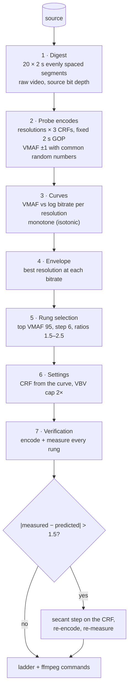
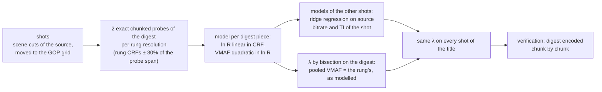

# Ladder engine

`qc ladder source -c h264|hevc|av1` builds a **per-title adaptive streaming
ladder**: a set of renditions (resolution, bitrate, encoder settings) chosen
for this title rather than from a static table. Each rung is verified with a
real encode.



## 1. Digest

Estimating a ladder on the whole title would cost one full encode and one VMAF
measurement per probe. Instead, the engine builds a **digest**: 20 segments of
2 s spread evenly over the title (systematic sampling, so every part of the
title is represented), concatenated into one file. Titles shorter than 40 s
are used whole.

- The digest is stored as **raw video in a NUT container**, so the ~25
  encodes and measurements that read it pay nothing for decoding. Above 4 GiB
  (e.g. long 4K digests) it is compressed losslessly with FFV1 instead.
- It keeps the **source bit depth** (8 or 10 bits), so 10-bit sources are
  measured at 10 bits.
- `concat` loses the frame rate, so timestamps are rebuilt at the source rate
  (`setpts=N/(rate·TB)`, `-r rate`).
- Segments are times of the video, from its first frame. Each one is seeked
  with an absolute seek from the video's first frame (the bitstream's first
  presentation time, `-seek_timestamp 1 -ss origin+t`): ffmpeg counts a
  plain `-ss` from the container's start, that of its earliest stream, and
  in a video starting after its audio, or a container starting before 0
  (AAC priming kept by Matroska), every segment would start early by the
  difference.

On a 10-minute cartoon, a digest covering 6.3% of the title predicted each
rung's full-title VMAF within 0.86 points on average (see
[validation](validation.md)).

## 2. Probe encodes

The digest is encoded at every candidate resolution not above the source
(default heights 2160, 1440, 1080, 720, 540, 360, 270; widths keep the aspect
ratio, rounded to even), each at three CRFs chosen so that together they span
roughly VMAF 97 to 40:

| Codec | Encoder | Default preset | Probe CRFs |
|---|---|---|---|
| h264 | libx264 | fast | 20, 27, 34 |
| hevc | libx265 | veryfast | 22, 29, 36 |
| av1 | libsvtav1 | 8 | 28, 40, 52 |

`--encoder nvenc` swaps in NVIDIA's hardware encoders, probed at their own
constant-quality (CQ) values: see [NVENC ladders](gpu.md#nvenc-ladders).

Encodes use a **fixed 2 s GOP** without scene-cut keyframes (x264
`-sc_threshold 0`, x265 `scenecut=0`), as ABR segmenting requires. Probes run
two at a time.

**Curve extensions.** Probes can stop short of the top quality, and two cases
get one extra probe at the lowest CRF − 7:

- the **top resolution**, when it does not reach the top quality, so that the
  top rung is capped by the content and not by the probes;
- the **resolution just below the top rung's**, when it might reach the top
  quality at least 10% cheaper. Its curve is projected past its probes with a
  slope that keeps shrinking as it did between its last two segments (curves
  flatten as quality grows), within 3× its top bitrate, which is what one probe
  can confirm. Easy content often reaches the top quality cheaper at 720p than
  at 1080p: on a 40 s cartoon excerpt, this moved the top rung from 1080p at
  4.35 Mb/s to 720p at 3.35 Mb/s at the same measured quality (−23%). On the
  drama, the projection promised at most a 1% saving and no probe was spent.

Each probe is measured with the [VMAF engine](vmaf.md) at **±1** (a sixth of a
rung step), in budget mode (at most 25% of the digest frames) with a small
pilot (16 clips). Within one encode, quality varies little across the digest,
so this is enough. On top of that, every probe has the same fixed GOPs, hence
the **same strata**, and uses the same seed, hence the **same sampled frames**.
These are *common random numbers*: sampling noise is largely shared between
probes. The **differences** between probes, which decide the curve shapes and
the resolution crossovers, are therefore much more precise than each absolute
value.

### Adaptive probing

`--probing adaptive` replaces the fixed design with probes placed where they
reduce the uncertainty of the ladder:

1. **Initial design**: the lowest and highest probe CRFs at every resolution
   (10 encodes for a 1080p source instead of 15). They give each curve its
   level and slope.
2. **Curve model with uncertainty**: each resolution's VMAF is a Bayesian
   **cubic in log bitrate**. Level and slope are left to the data; the
   curvature and cubic terms get a prior fitted on real ladders (quadratic
   coefficient −4.5 ± 2.5 across 27 curves of H.264, HEVC and AV1 ladders,
   cubic ± 1). Each probe weighs by its own measurement half-width. A cubic
   fits a dense 7-CRF grid of every resolution of a real title within 0.1
   VMAF, where linear interpolation between probes 14 CRF apart errs by 4 to
   6. Once two resolutions have three probes, their mean curvature becomes
   the prior of the others (±1.5): curves of one title share their shape.
3. **What must be known**: the ladder is planned on the fitted curves, then
   every rung's quality on its resolution, and every **crossover** where
   another resolution (not above the previous rung's) could beat the rung's
   by more than the tolerance, become quantities with a 95% half-width. A
   higher resolution just below its lowest probe (within one rung ratio) also
   competes: the envelope never extrapolates, so only a probe there can tell
   whether it wins.
4. **Next probes**: the covariance of a Bayesian linear model does not depend
   on the measured values, so the benefit of a probe is known **before
   encoding it**. The next batch (`--parallel` probes, 2 by default) is
   chosen greedily: each pick is the probe, at the position of an uncertain
   quantity, that reduces the summed excess uncertainty most, the later picks
   accounting for the earlier ones.
5. **Stop** when every rung is known within **±0.5 VMAF** (or ±3% bitrate,
   whichever is looser on the curve) and every crossover is settled, or at
   the **budget**: two probes fewer than the fixed design (14 for five
   resolutions), so adaptive probing never costs more.

The uncertainty that drives the probes is the curve's **shape** uncertainty
(computed as if probes were measured almost exactly): measurement noise is
set by `--precision`, and averaging it with more encodes would cost more than
scoring more frames. The half-width reported with each rung
(`predictionError`, "95.1±0.5" in the report) includes the measurement noise
of the probes, taken as independent: with common random numbers it is
pessimistic.

Adaptive probing is **opt-in**: on real titles it was more accurate at one
probe fewer, but calibrations occasionally cancelled the saving (see
[validation](validation.md#adaptive-probing)).

### Faster probes at another preset

`--probe-preset` encodes the probes at another preset than the rungs
(`--preset`), a faster one, the two-step convex hull of Meta's AV1
pipeline (Wu, Kondratenko, Katsavounidis, SPIE 2020). Two things carry
over differently from a fast preset to a slow one:

- the **shape of the envelope** (which resolution wins at which bitrate)
  carries over well: rungs planned on x264 ultrafast probes landed on the
  resolutions of the exhaustive optimum of x264 fast;
- the **CRF scale** does not: at equal CRF, x264 veryfast scores 2–9 VMAF
  below fast on the drama, x264 ultrafast about the same, SVT-AV1 preset 10
  2–5 below preset 8.

So the rungs are planned on the fast probes, then the **top and bottom
rungs are encoded at `--preset`** (the anchors). At each anchor's quality,
the ratio between the two presets' bitrates and the difference of their
CRFs move the probes: a constant bitrate saving along a curve, like a
BD-rate, and a CRF offset, interpolated in log height between the anchors.
The rungs are planned again on the moved probes and verified at `--preset`
as always; calibration corrects what the anchors did not. In replays of
five preset pairs on two titles, one anchor per rung resolution and two
interpolated anchors missed by about as much (0.5–0.9 VMAF on average for
the pairs worth using, see [validation](validation.md#probes-at-a-faster-preset---probe-preset));
two cost fewer slow encodes.

It only pays when `--preset` encodes **several times slower** than the
probe preset: the anchors are two encodes at `--preset`, and a probe's
measurement costs the same at either preset. Drama, 1 min, M2 Max:

| `--preset` | `--probe-preset` | Without | With | Rungs |
|---|---|---|---|---|
| SVT-AV1 4 | 8 | 5 min 21 s | 4 min 03 s (−24%) | same resolutions and bitrates (±1%), none calibrated |
| x264 fast | ultrafast | 2 min 09 s | 2 min 01 s (−7%) | vs exhaustive optimum: −0.23 VMAF, −1.8% bitrate (without: −0.03, −0.7%) |
| x264 slow | fast | 3 min 01 s | 3 min 17 s | slower: slow is only ~1.5× fast here |
| x265 medium | veryfast | 8 min 06 s | 8 min 40 s | slower: veryfast probes are barely cheaper on ARM |
| SVT-AV1 8 | 10 | 2 min 19 s | 2 min 52 s | slower |

The x264 fast, x264 slow and SVT-AV1 8 runs anchored every rung resolution
(3–4 anchors), before the two anchors of today; with two, they would save
one or two encodes at `--preset`, not enough to change their verdicts.

Pairs to avoid: x265 ultrafast, whose tools differ too much from the other
x265 presets (0.9–2.2 VMAF off after anchoring in replays), and another
codec's probes (H.264 probes for an HEVC ladder: 1.8–6.5 VMAF off on the
cartoon), which is not offered.

### Quality level of the probes

Every probe and rung is scored on the **same sampled frames** of the digest
(common random numbers): their differences are precise, but they share the
error of those frames. Frames harder than the digest's average put every
measurement below its exact value by the same amount. On a 59-minute
reality-TV title, the default sample read 0.67, 0.84 and 0.91 VMAF below the
exact value on three very different encodes (x264 1080p, SVT-AV1 1080p, x264
720p). At the top of a rate-quality curve, which is flat, one VMAF point is
25–30% of bitrate: the AV1 ladder aimed at VMAF 94 on that shifted scale, and
its top rung delivered 94.9 at 5.96 Mb/s where 94.1 needed 4.58 Mb/s.

So after probing, the top rung planned on the probes is encoded once at the
rungs' preset and scored **both like a probe and on every frame**: the
difference (`probing.level.offset` in the JSON) moves every probe, and every
sampled rung measurement, onto the exact scale. The top rung is then
verified on every frame and corrected until it lands within 0.5 of its
target (a second secant step, between its own two measurements, when the
first falls short). On that title, at `--top-vmaf 94`:

| Top rung | Before | After |
|---|---|---|
| AV1 (SVT preset 8) | CRF 30, 5.00 Mb/s, ≈ 94.6 exact (93.6 as sampled) | CRF 31, 4.23 Mb/s, 93.83 exact |
| H.264 (x264 fast) | CRF 24.5, 5.48 Mb/s, 92.9 as sampled | CRF 24, 5.43 Mb/s, 93.86 exact |

The offsets measured were +0.99 (AV1) and +0.69 (H.264). The AV1 ladder,
which came out above the H.264 one at their measured qualities, is 22%
lighter at the top: the exact curves of the title put AV1 20% below H.264 at
VMAF 94. It costs one encode and an exact scoring of the digest (about 25 s
with a 1080p digest), plus an exact scoring of the top rung and, when the
top rung needs one, a correction encode: 10–30% more time on that title.

## 3. Rate-quality curves

For each resolution, the probes give points (bitrate, VMAF, CRF). The curve
is **piecewise linear in log(bitrate)**:

- VMAF is made **non-decreasing** by isotonic regression (pool adjacent
  violators): close probes can be inverted by measurement noise, and a
  non-monotone curve would break the rung search.
- VMAF is **never extrapolated** beyond the probed bitrates: the envelope
  only trusts measurements.
- The CRF, on the other hand, **is** extrapolated linearly: log(bitrate) is
  close to linear in CRF, which is what lets a rung ask for a bitrate between
  or beyond the probes.

## 4. Envelope

The envelope samples 200 log-spaced bitrates between the lowest and the
highest probe. At each one it keeps the resolution whose curve gives the
highest VMAF. Low bitrates favour low resolutions and high bitrates favour high
ones. The crossover points depend on the content, and capturing them is most of
the value of per-title encoding.

## 5. Rung selection

Defaults (all configurable, see [CLI](cli.md)):

| Constraint | Default | Rationale |
|---|---|---|
| Top VMAF | 95 | Above ~93–95 viewers see no difference while bitrate keeps growing |
| Step | 6 VMAF | About one just-noticeable difference |
| Bitrate ratio between rungs | 1.5–2.5 | Keeps ABR switches meaningful without holes |
| Minimum VMAF | 30 | Below this a rung is not worth serving |
| Minimum bitrate | 145 kb/s | Apple's lowest rung |
| Maximum rungs | 8 | |
| Maximum bitrate | none | Device or delivery cap |

Algorithm:

1. **Top rung**: the cheapest envelope point reaching the top VMAF (or the best
   point when the title never reaches it), capped by the maximum bitrate.
2. **Next rungs**: from the previous rung (bitrate B, quality V), target
   quality V − step. Its bitrate is the lowest envelope bitrate reaching it,
   interpolated in log scale, then clamped to [B / 2.5, B / 1.5].
3. Stop at the minimum bitrate, the minimum quality or the maximum number of
   rungs.
4. **Resolutions never increase** as bitrate decreases. A rung takes the
   highest resolution not above its predecessor whose curve covers its bitrate.

### Imposed shapes

The automatic shape is the default. `--rungs` imposes one instead:

| `--rungs` | Rungs | Resolutions | Bitrate of each rung |
|---|---|---|---|
| `auto` (default) | as many as the steps allow | best of the envelope | one step (6 VMAF) below the previous rung, ratio 1.5–2.5 |
| `5` | exactly 5 | best of the envelope, never increasing | envelope bitrate reaching the rung's quality target |
| `1080,720,720,540,360` | one per entry, highest first | as listed (a height may repeat) | bitrate at which **that resolution's** curve reaches the target |

In both imposed shapes the **quality targets are evenly spaced** from the top
(`--top-vmaf`, or the best the title reaches) down to the title's natural
bottom: the envelope quality at `--min-bitrate`, but not below `--min-vmaf`. With
imposed resolutions only those resolutions are probed, which saves encodes, and
a rung whose target lies more than 2 VMAF outside its resolution's probed range
is flagged as *extrapolated* (its verification encode then matters most).
Resolutions above the source, or a count that contradicts the listed
resolutions, are rejected before any encode.

Example on the 1-minute drama (H.264), every rung verified:

```
qc ladder source.mov --rungs 1080,720,540,360 --top-vmaf 93
  1080p  4.44 Mb/s  CRF 24    predicted 93.0  measured 93.4
   720p   909 kb/s  CRF 31    predicted 76.0  measured 77.2
   540p   418 kb/s  CRF 34    predicted 59.0  measured 58.7
   360p   223 kb/s  CRF 34    predicted 42.1  measured 41.6
```

## 6. Settings

- **CRF**: read on the rung resolution's curve at the rung bitrate, rounded to
  the encoder granularity (0.5 for x264/x265, integer for SVT-AV1) and clamped
  to the codec range.
- **Capped CRF (VBV)**: `maxrate = 2 × bitrate` over a 2 s buffer
  (`bufsize = 4 × bitrate`), the HLS peak limit for VOD. A 1.5× cap was tried
  first: it cost up to 4 VMAF points on a cartoon with a very bursty bitrate.
- **10-bit**: `--encode-bit-depth 10` encodes in `yuv420p10le` (Main10). It
  is usually more efficient for HEVC and AV1, even from 8-bit sources. HDR
  sources are always encoded in 10 bits ([section 10](#10-hdr-sources)).
- Every rung comes with a copy-pasteable ffmpeg command for the whole title,
  writing to a numbered file (`01-1080p.mp4`, `02-720p.mp4`…) so rungs sharing
  a resolution do not overwrite each other.

## 7. Verification and calibration

Each rung is encoded on the digest **with its final settings, VBV included**,
and measured. The report shows predicted and measured VMAF and bitrate side by
side. The **top rung is scored on every frame** of the digest: it is the
quality the ladder promises (`--top-vmaf`), and its most expensive rung.

When a rung misses its prediction by more than 1.5 VMAF (0.5 for the top
rung), its CRF is corrected
by **one secant step**. The step uses the slope dVMAF/dCRF between the two
probes of its resolution that surround its CRF, and the rung is then
re-encoded and re-measured. The measured bitrate of a corrected rung replaces
the planned one, as the better estimate for the manifest's `BANDWIDTH`.

### Rung quality

The verification encodes are the renditions viewers will get, so they are
measured with more than VMAF: the metrics and viewing devices of `--metrics`
and `--devices` (by default XPSNR, CAMBI and PSNR, about 5% more CPU), on the
same sampled frames. Probes stay VMAF-only: they only shape the curves. The
report adds a *Rung quality* table and two checks:

- **Banding-limited rungs**: a rung with visible banding (CAMBI above 5) on
  at least 5% of its scored frames; isolated frames (a dark fade, a sky) do
  not count. More bitrate at the same bit depth fixes banding poorly; a 10-bit
  encode (`--encode-bit-depth 10`) fixes it better.
- **VMAF and XPSNR disagreeing**: VMAF scores a rung at least 2 points above
  another while XPSNR scores it at least 0.5 dB below, beyond the sampling
  noise of either. It usually points at a resolution trade-off VMAF rewards
  more than pixel fidelity (upscaled low resolutions, sharpening) and is
  worth a look before trusting the ladder's order.

With `--devices phone,4k` each rung also gets the VMAF of those viewing
conditions: a rung that looks mediocre on a TV can be plenty for a phone.

## 8. Per-shot rungs

`--per-shot` adds to every rung a per-shot version with the same pooled
(frame-weighted mean) VMAF: one CRF per shot, allocated at equal
rate-quality slope, a lighter version of Netflix's Dynamic Optimizer.



- **Shots** come from the scene detection of the [analysis](analysis.md)
  (one decode of the title). `qc run` reuses the analysis it already made of
  the source; a standalone `qc ladder` analyses the source alongside the
  digest and the probes, so the decode overlaps them instead of following
  them. Each cut moves to the nearest boundary of the fixed 2 s GOP grid, so
  every rung keeps aligned keyframes, as ABR segmenting requires; cuts closer
  than a GOP merge.
- **Per-shot probes**: for each rung resolution, the digest is encoded at two
  CRFs bracketing that resolution's rungs, chunk by chunk as the per-shot
  rungs will be (a chunk restarts rate control and lookahead: ~3% bitrate at
  equal CRF), and **every frame** is scored.
  Every digest piece (the part of a shot inside a digest segment) gets its
  bitrate and VMAF at both CRFs: log bitrate is linear in CRF, VMAF quadratic
  in log bitrate with the curvature of the title's curve at that resolution.
- **Shots outside the digest** (most of a long title) get a model predicted
  from their analysis features — log source bitrate and mean temporal
  information — by a ridge regression fitted on the measured shots.
- **Allocation**: for a slope λ, each shot takes the CRF maximising
  VMAF − λ·bitrate; at the optimum every shot has the same dVMAF/dbitrate.
  Equal slope in **bitrate**, not in log bitrate, is what maximises the pooled
  VMAF at a given total size: equal dVMAF/dlog(R) would favour shots that are
  already expensive. λ is found by bisection so that the digest's pooled VMAF
  equals the per-title rung's **as the same models see it** (every shot at the
  rung's CRF): the models' own biases (no rate cap, every frame scored) then
  cancel, where aiming at the rung's measured VMAF left per-shot rungs ~1 VMAF
  short. The same λ is then applied to every shot of the title. CRFs stay within the probes' range ± half the
  spread, where the models are trusted.
- **Mechanism**: x264 and x265 accept zones through their private parameters,
  but SVT-AV1 has no per-frame quantiser control reachable from ffmpeg. The
  one mechanism working for all three is **chunked encoding**: each shot (a
  run of whole GOPs) is encoded separately, starting with its keyframe, and
  the chunks are joined without re-encoding (`-f concat -c copy`). Decoding
  the joined file gives exactly the frames of the separate chunks for x264,
  x265 and SVT-AV1 (checked by frame checksums). Adjacent shots sharing a CRF
  are merged. The chunks of one encode are independent, and encode four at
  a time: a chunk is too short for an encoder to keep every core busy, and
  ffmpeg's start-up is a good part of it. Each chunk decodes its source from 2 s before its first frame
  and drops the frames before it (`trim` in its filter chain): seeking straight to the
  chunk lands on the source keyframe before it, which in a long-GOP source
  need not be a clean random access point, and the H.264 decoder then drops
  frames whose references it lacks (see
  [validation](validation.md#per-shot-rungs-ladderval--per-shot--shot-optimum)). The
  chunks of the title (the rung's command) are seeked from the video's first
  frame with absolute seeks, like the digest's segments, so a video starting
  after its audio or a container starting before 0 gets every frame once.
  Each chunk's timestamps then restart at its first frame
  (`setpts=PTS-STARTPTS`): counted from the trim point, half a frame
  earlier, frames whose container times are rounded (Matroska's
  milliseconds at 60, 59.94, 29.97 or 23.976 fps) fall on either side of
  the encoder's half ticks, and one rounded up would leave a hole of a frame
  at the join. The joined rung is constant frame rate at the source's rate.
  The command of a per-shot rung is a short shell script.
- **Verification**: the digest is encoded chunk by chunk with the pieces'
  CRFs and the rung's VBV cap, and measured, two rungs at a time like the
  per-title verification. The gain reported is the bitrate
  saved against the per-title rung **at equal VMAF**, the VMAF difference
  between the two converted to bitrate by the local slope of the rung's curve.

### The per-shot ladder

Per-shot rungs are, read the other way, **a ladder for each shot**: the
reports show the whole shots × rungs allocation, and `ladder.Result` keeps
it (`Shots`, and per rung `PerShot.Shots`, in the same order).

- For each shot: its time range, whether its model was **measured** on the
  digest or **predicted** from similar shots, its complexity (the source's
  bitrate over the shot, a proxy of spatio-temporal complexity as the
  mezzanine encoder saw it, and the mean temporal information TI) and its
  **cost**, its predicted bitrate over its rung's average, averaged over the
  rungs.
- For each shot and rung: the CRF, the predicted bitrate and VMAF (the shot
  model at that CRF, without the rung's rate cap) and, for shots in the
  digest of a verified rung, the bitrate and VMAF of the shot's part of the
  verification encode (`measured`; its VMAF comes from the sampled frames
  falling in the shot, `scoredFrames`).
- **Terminal**: a table of every shot (up to 16; longer titles list the 8
  most and 8 least expensive, in time order, with the skipped shots
  counted), one cell per rung with the CRF, the predicted bitrate and, when
  the terminal is wide enough, the predicted VMAF.
- **HTML**: a chart of every rung's per-shot bitrate along the title, as
  steps on a log scale: a vertical slice is the shot's own ladder. It shares
  the zoom of the other time charts; its tooltips give the shot's exact time
  range and, per rung, the bitrate, CRF, predicted VMAF and measurement. The
  sortable table below lists every shot; sorting a rung's column by bitrate
  ranks the shots by cost, and a shot's start time zooms the chart on it.

Per-shot rungs cost two exact measurements per rung resolution plus one
verification per rung, on top of the per-title ladder. They are opt-in: on
short titles they saved 0–4% at equal VMAF (60–100% of the exhaustive
per-shot optimum, itself only 0.5–5.5% on this corpus); on a long title,
where most shots are predicted rather than measured, they lost 1% over the
whole title (7–12% by their digest verification; see
[validation](validation.md#per-shot-rungs-ladderval--per-shot--shot-optimum)).

### Per-shot resolution (experimental)

`--per-shot-resolution` (library: `Options.PerShotResolution`, which implies
`PerShot`) lets each shot of a per-shot rung pick its **resolution** as well
as its CRF: the per-shot convex hull over (resolution, CRF) of Netflix's
Dynamic Optimizer, at equal slope λ and under the same pooled-quality target
as per-shot CRF. `--per-shot` alone is unchanged.

- **Resolutions**: a shot of a rung may take the rung's resolution or the
  rung resolutions just above and below it (only resolutions the ladder
  already probed). Static, detailed shots tend to go up, busy ones down.
- **Models**: the per-shot probes of every rung resolution are widened to
  the qualities of the neighbouring resolutions' rungs, read on the
  resolution's per-title curve: its CRF range grows, and when it spans more
  than three spreads (~12 x264 CRF) extra probes go inside it. Every
  segment between two adjacent probes gets its own models, exact through
  both, and offers its CRFs to the allocation: models stay local. (A first
  version fitted one model per shot through all the probes by least
  squares; on the drama excerpt it predicted the top per-shot rung 1.9 VMAF
  above its verification.)
  VMAF is always computed at the model resolution after bicubic upscaling,
  so shots at different resolutions compare on one scale.
- **Cost**: the extra probes are reported (`Result.ShotProbing`: probes and
  `extra`). On the 24 s drama excerpt with 4 rung resolutions: 14 exact
  chunked probes of the digest instead of 8 (+6), one verification per
  rung as before.
- **Encoding**: chunks carry their resolution (`encode.Chunk.Width/Height`)
  and are joined into one file per rendition. x264 and SVT-AV1 repeat
  their parameter sets (SPS/PPS, sequence header) at every keyframe, so the
  MP4 concat of chunks at several resolutions decodes exactly (every frame
  identical to the chunks decoded alone). x265 in MP4 keeps them only in the
  first chunk's `hvcC`, and the later chunks decode as garbage: HEVC
  renditions changing resolution are joined through MPEG-TS
  (`hevc_mp4toannexb` writes VPS/SPS/PPS at every keyframe) and remuxed to
  MP4 as `hev1`. The per-shot commands do the same.
- **Measurement**: the reference and the distorted stream are decoded at
  the model resolution; a stream changing resolution keeps its ffmpeg filter
  graph (`-reinit_filter 0`), whose scale reconfigures itself for the new
  size. A rebuilt graph would restart the frame counter of the sampling
  `select` and score the wrong frames. Frames are bit-exact with each chunk
  decoded and upscaled alone.
- **Manifest**: a rendition declares its largest resolution
  (`PerShot.Width/Height`, the HLS `RESOLUTION` / DASH `width`/`height`),
  and its bitrate as usual. Its `CODECS` level must cover that resolution.
- **Player caveat**: resolution then changes inside a rendition, at shot
  boundaries (always keyframes). ffmpeg decodes it cleanly (checked above);
  players are not tested here. Many players cope with resolution changes
  at keyframes (they happen on every ABR switch), but hardware decoders and
  some TV and set-top players may not reinitialise mid-rendition, and an
  `avc1`/`hvc1` sample entry with a different in-band SPS is not strictly
  conformant (`avc3`/`hev1`, or one sample entry per resolution, is). Apple requires `hvc1` for HEVC, which
  excludes in-band parameter sets: HEVC per-shot resolution does not suit
  Apple devices. Test the target players before using it.

**Results** (H.264, full title, exact VMAF; see
[validation](validation.md#per-shot-resolution-ladderval--shot-resolutions)):
per-shot resolution saved 2.0% on a drama excerpt and 3.6% on a cartoon
excerpt at equal pooled VMAF (per-shot CRF: 0.8% and 0.1%), but unevenly.
The large gains sit at the ends of the ladder, where the per-title ladder's
resolution was not the best one: the cartoon's 1080p rung moved entirely
to 720p (−15%, level with the exhaustive (resolution, CRF) optimum), and
the 270p rungs moved to 360p (−8 to −12%). Middle rungs gained little or
lost (−11% on the drama's 720p rung, which came out 1.2 VMAF short): the
shot models, fitted on a widened CRF range, predict VMAF about 2 points too
high there, and allocations exploit such errors. It costs 6–8 extra exact
probes (+3–22% build time). It stays **experimental**: most of its gain is
a per-title resolution choice made per shot, and it needs players that
accept resolution changes within a rendition.

## 9. Film grain synthesis (AV1)

`--film-grain auto|off|1-50` (AV1 only; other codecs of a run ignore it)
encodes with SVT-AV1 film grain synthesis (`film-grain=N:film-grain-denoise=1`):
the encoder denoises its input, codes the clean picture and signals grain
parameters the decoder adds back. Grain is what codecs spend the most bits on
for the least perceived quality.

- **Detection**: the noise of the digest's luma is measured on the 20%
  flattest 16×16 blocks of 8 frames with Immerkær's estimator (the
  Laplacian-difference mask cancels smooth content, so what remains there is
  grain), in 8-bit code values. Clean digital sources measured 0.2–0.5; `auto`
  treats 1.0 and above as grainy.
- **Level calibration** (`auto`): SVT-AV1's level is a denoising strength, and
  how much grain the decoder puts back depends on the content (on synthetic
  grain of σ 2.7 and 5.8, level 30 gave back 89% and 52% of it). The digest
  is encoded at levels 10, 25 and 50 (two at a time) and the level whose
  synthesised grain comes closest to the source's is kept.
- **Fidelity against a denoised reference**: VMAF penalises synthesised grain
  for not matching the source's grain sample by sample. Every probe and rung
  is therefore decoded **without its grain** (`-export_side_data film_grain`)
  and scored against a denoised reference: the digest encoded near losslessly
  (CRF 4) with the same level and decoded without grain, i.e. SVT-AV1's own
  denoised picture. The bitrate stays the encoded file's.
- **Grain fidelity check**: each rung, decoded as viewers see it (grain
  applied), has its noise compared with the source's at the rung's
  resolution: the standard deviation (ratio shown in the report, flagged
  beyond ±30%) and the lag-1 autocorrelation of the high-pass residual, a
  two-number signature of the grain's spectrum (a coarse grain is more
  correlated than a fine one).

Film grain cannot be combined with per-shot rungs.

## 10. HDR sources

A PQ or HLG source gets a 10-bit ladder (an 8-bit request, the default
included, is upgraded and reported) whose every probe, rung and rendered
command carries the source's colour description (`setparams` on the frames,
which the encoders turn into VUI or sequence header fields) and, for HDR10,
its mastering display and content light level: x265 `hdr10=1:hdr10-opt=1:
master-display=…:max-cll=…`, SVT-AV1 `mastering-display=…:content-light=…`,
colour tags only for x264 (HDR in H.264 is rarely played, the ladder warns)
and NVENC (which writes the metadata only when ffmpeg forwards it from the
source). The digest keeps the code values, and its measurements know they
score HDR. Rungs are placed by VMAF on the HDR signal (`--hdr-metric pq`) or
on an SDR tone mapping (`tonemap`); verified rungs also get wPSNR and ΔE
ITP. Why, and the checks of the rendered encodes: [hdr.md](hdr.md#5-hdr-ladders).

## Cost and accuracy

| Title | Codec | Wall time (M2 Max) | Check |
|---|---|---|---|
| Drama, 1 min, 1080p | H.264 | ~2 min | vs exhaustive optimum: mean −0.04 VMAF, −0.7% bitrate |
| Cartoon, 10:36, 1080p | H.264 | 1 min 39 s | rungs on the full title: predicted VMAF within 0.86; bitrate ~7% above prediction |
| Drama, 1 min | AV1 (SVT preset 8) | 2 min 12 s | top rung 35% lighter than H.264 |
| Drama, 12 s, 10-bit | AV1 Main10 | 50 s | predictions within 0.4 |
| Drama, 1 min | HEVC (x265 veryfast) | 6 min 04 s | x265 is slow on ARM; try `--preset superfast` |
| Drama, 1 min | H.264, `--probing adaptive` | ~2–3.5 min | 22 encodes instead of 23; vs exhaustive optimum −0.12 VMAF, −1.2% bitrate |
| Drama, 1 min | AV1, `--probing adaptive` | ~5.5 min | 22 encodes; −0.05 VMAF, −0.6% from the optimum (fixed: +1.94, +5.3%) |
| Drama, 30 s | H.264 / AV1, `--per-shot` | +2–4 min | full title: −2.1% / −4.1% bitrate at equal VMAF |
| Drama, 1 min | H.264, `--per-shot` | 5 min 35 s (per-shot stage 3 min 15 s) | before parallel chunks and verifications: 6 min 29 s (4 min 05 s), same allocations |
| Drama, 1 min | AV1 preset 4, `--probe-preset 8` | 4 min 03 s | 5 min 21 s probed at preset 4, same rungs ([details](#faster-probes-at-another-preset)) |
| Drama, 12 s + synthetic grain σ 5.8 | AV1, `--film-grain auto` | +1.5 min (calibration) | top rung 5.8 Mb/s instead of 104.6 Mb/s, 81% of the grain given back |

The cost grows with the digest (capped at 40 s), not with the title length. An
exhaustive search on the full title grows with the title length (about 2 hours
for the 10-minute title).

Plan a margin of ~7% on `BANDWIDTH`: on the long title, full-title bitrates
came out 3–10% above the digest predictions.
