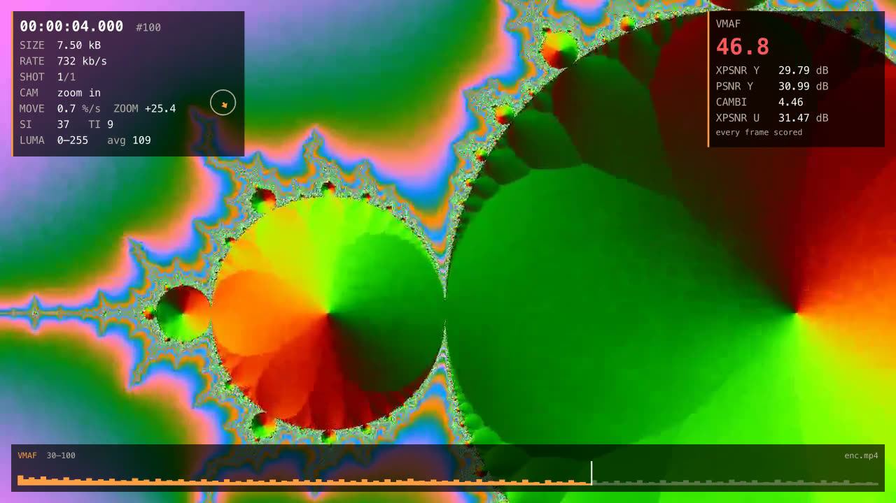

# Annotated videos (debug overlay)

`--overlay annotated.mp4` writes a copy of the video with the analysis burnt
into its frames: what qc measured on each frame, shown on that frame. It is
the quickest way to check an analysis against the picture (is this cut
real? is the camera really panning? which frames pull VMAF down?) and to
share a finding with someone who will not read a JSON report.

```sh
qc analyze video.mp4 --overlay annotated.mp4                      # the frame analysis
qc analyze video.mp4 --fast --overlay annotated.mp4               # the bitstream only, no decoding
qc vmaf reference.mov encode.mp4 --exact --overlay annotated.mp4  # the encode, with its per-frame VMAF
qc run encode.mp4 -r reference.mov --codecs= --overlay annotated.mp4 --overlay-height 720
```

`vmaf` annotates the distorted video (the second file), `analyze` and `run`
the source. The copy has the same frames, timestamps, frame rate and audio
as the video it annotates.

## What it shows



*A synthetic zoom into the Mandelbrot set, encoded at CRF 36 and compared
with `qc run enc.mp4 -r src.mp4 --exact --codecs= --overlay annotated.mp4`:
the camera zooms in (the dial's arrow is the residual pan), the frame
scores VMAF 46.8.*

Translucent corner panels and a strip along the bottom, in the brand's
orange: the middle of the picture stays clear.

| Item (`--overlay-items`) | Where | Shows | Needs |
|---|---|---|---|
| `time` | frame panel | timecode (hh:mm:ss.mmm from the first frame), frame number (from 0, as ffmpeg and the JSON reports count), packet size, `KEY` on keyframes | — |
| `bitrate` | frame panel | bitrate of the last second of frames | — |
| `shots` | frame panel, picture | shot number / shot count, `CUT` for half a second after a cut, an orange frame around the picture on the first two frames of a shot | frame analysis |
| `motion` | frame panel | camera work of the shot (pan, tilt, zoom, tracking, handheld… with its direction, `SHAKY`), speed of the frame's camera move (% of the width per second) and zoom (%/s), and a dial whose arrow is the camera's direction (a dot when it holds still; three lengths for slow, medium and fast moves) | motion analysis |
| `siti` | frame panel | SI and TI of the frame (P.910) | frame analysis |
| `levels` | frame panel | luma range and average (8-bit code values), the range in red when the frame leaves the nominal levels | frame analysis |
| `hdr` | frame panel | peak and average light of the frame, cd/m² | PQ or HLG video |
| `loudness` (or `audio`) | frame panel | short-term (3 s) and momentary (400 ms) loudness of the default track when the frame is shown, LUFS ([audio](audio.md)) | audio analysis |
| `flags` | badges, top | `LETTERBOX`, `PILLARBOX`, `BLACK`, `FROZEN`, `BANDING` (CAMBI above 5, from a comparison), `OUT OF RANGE` (1% of the samples outside the nominal levels) | frame analysis or comparison |
| `quality` (or `vmaf`) | quality panel | VMAF of the frame (green from 90, amber from 80, red below), up to four other metrics (XPSNR, PSNR, CAMBI…), how the frames were scored | comparison |
| `timeline` | bottom strip | the lowest VMAF of each slice of the title (or the bitrate without a comparison), shot cuts as ticks, a playhead; the played part lights up | — |

Every item is shown by default; an item without data is left out (no
quality panel without a comparison, no light levels on SDR). `--fast`
annotates with what the bitstream tells: time, bitrate, timeline.

**VMAF on every frame needs `--exact`.** A sampled measurement scores a few
clips across the title: the quality panel shows the score on those frames
and a dash elsewhere, with the share of frames scored, and the timeline
shows the scored slices only.

## How it works

The overlay is an [ASS](https://en.wikipedia.org/wiki/SubStation_Alpha)
subtitle script, generated by package `overlay` from the reports and drawn
by libass through ffmpeg's `subtitles` filter, in the encode that writes the
copy. ASS draws styled, positioned text and vector shapes (the panels, the
dial's arrow, the timeline's bars), so nothing is rendered in Go and no
frame goes through a pipe: libass costs about 2 ms of one core per 1080p
frame, and the encode is the rest.

- **Frame-accurate timing.** ASS times are in centiseconds, and the filter
  renders a frame with the events active at its timestamp. Every event
  starts halfway between two frames, rounded to the centisecond, so that it
  lands on its frame at any frame rate below 100 fps (23.976 and 29.97
  included): tests burn a bar at a different place on every frame of
  23.976, 25, 29.97 and 59.94 fps clips and check every frame of the copy,
  in one pass and in segments (with x264, and VideoToolbox on macOS), whose
  timestamps must be those of the single pass.
  Timestamps are taken on the timeline ffmpeg's filters see (the first
  frame's time on the container's, `bitstream.Report.Start`), so the
  overlay stays on its frames when the video starts after the audio (also
  tested).
- **Small scripts.** Each row, badge and drawing is a track, and a track
  only starts an event when what it shows changes: a shot's camera work is
  one event, the timeline and its playhead one event each for the whole
  title (libass animates the playhead and the lit part). Values are rounded
  to what can be read at playback speed. The rows that change on every
  frame (timecode, size, bitrate, and on moving pictures SI/TI, levels and
  the camera move) dominate: a 10-minute 25 fps title makes a 9.8 MB script
  with about 5 events per frame, written in 0.1 s.
- **Resolution.** The script is laid out on a 1080-line canvas with the
  video's aspect ratio, and libass scales it to the copy: `--overlay-height
  720` encodes a smaller copy, faster, with the same layout.
- **Font.** A monospaced font keeps the values from shifting as digits
  change: Menlo on macOS, DejaVu Sans Mono elsewhere (in the Docker
  images). fontconfig or CoreText substitute another font when it is
  missing.
- **Hardware encoding.** The copy is a debug copy, encoded by the
  machine's media engine when it has one (`--overlay-encoder auto`):
  VideoToolbox (`h264_videotoolbox`, constant quality `-q:v 60`) on macOS,
  NVENC (`h264_nvenc`, `-cq 21`, preset `p4`) with `--gpu`, x264 (CRF 20,
  preset `fast`) elsewhere. `auto` tries VideoToolbox on a few test frames
  first and falls back to x264 with a warning (an Intel Mac without
  constant quality, an ffmpeg built without it); an encoder named with
  `--overlay-encoder` is checked before any work instead. At `-q:v 60`,
  VideoToolbox writes about the bitrate of x264 at CRF 20 (3 Mbit/s on a
  1080p cartoon, 5.4 against 7.2 on live action) and the text is as crisp.
- **Segments.** One ffmpeg draws the overlay on a single thread, at most
  ~350 frames per second at 1080p, less on long scripts: too slowly to
  keep a hardware encoder busy. The copy is then rendered in segments
  (`--overlay-workers`, six at once with VideoToolbox, four with NVENC; x264
  already keeps every core busy in one pass). The segments start at
  keyframes, three per worker and at least 750 frames each (a shorter
  video is rendered in one pass). Each ffmpeg keeps the source's
  timestamps (`-copyts`), seeks 3 s before its segment, decodes (with
  VideoToolbox on macOS: one session is slower than ffmpeg's CPU decoder,
  six are not) and keeps exactly the frames presented from the segment's
  first frame to the next segment's, cut by timestamp after the decoder.
  It loads its own slice of the script, holding only the events shown
  during its segment. The segments are joined without re-encoding (concat
  demuxer, each one lasting until the next one's first frame), and the
  source's audio is added then: the copy has the source's frames at the
  source's timestamps, as a single pass does. A segment that renders
  another frame count than planned (a seek that landed too late) makes the
  copy start over in a single pass. The segments need as much free disk
  space as the copy, next to it, until they are joined.

The copy is H.264, 8-bit 4:2:0, with the source's first audio stream
copied (encoded to AAC when an MP4 cannot hold it); MP4, MOV and MKV
outputs work. HDR videos are annotated on their signal and keep its colour
description: the text is drawn at the signal's peak.

qc checks that ffmpeg has the `subtitles` filter (libass) before any work:
without it, `--overlay` fails at once. Homebrew's ffmpeg and the Docker
images have it.

## Performance

Apple M2 Max (8 performance and 4 efficiency cores, two media encode
engines), ffmpeg 9.0, a real 1080p25 H.264 title at 26 Mbit/s with a full
frame analysis: 10:36 (15 903 frames), and the same title concatenated six
times without re-encoding, 59 minutes (88 500 frames, a 52 MB script of
450 000 events). Wall clock and CPU time of the whole copy (ffmpeg
processes); the x264 copy of the 59-minute title ran next to other work for
part of its run.

Where the time went with x264 (10:36 title):

| Step | Wall clock | CPU time |
|---|---|---|
| Decoding alone (CPU) | 23.6 s (675 fps) | 164 s |
| Decoding + libass (the `subtitles` filter, no encode) | 44.3 s (359 fps) | 199 s |
| The annotated copy with x264 (CRF 20, `fast`) | 110 s (145 fps) | 1117 s |

x264 took over 80% of the CPU. libass costs about 2 ms of one core per frame,
on the filter thread of its ffmpeg, which caps one ffmpeg at ~360 frames
per second (~300 on the 59-minute script).

The levers, on the 59-minute title:

| Copy | Wall clock | CPU time |
|---|---|---|
| x264, one pass (before) | 778 s (114 fps) | 6371 s |
| VideoToolbox, one pass (CPU decoding) | 297 s (298 fps) | 1226 s |
| VideoToolbox, one pass, VideoToolbox decoding | 351 s (252 fps) | 440 s |
| VideoToolbox, 6 segments, the whole script in each | 228 s (389 fps) | 543 s |
| **VideoToolbox, 6 segments, a slice of the script in each (default)** | **217 s (407 fps)** | **387 s** |
| the same at `--overlay-height 720` | 115 s (770 fps) | 434 s |

The 10:36 title takes 41 s (386 fps, 73 s of CPU) by default, 110 s
(1117 s of CPU) with x264.

- **The encoder is the limit.** VideoToolbox encodes 1080p H.264 at
  ~195 frames per second per session and ~395 with two sessions or more
  (the two engines), whatever its settings (profile, entropy coding,
  reference frames, `-prio_speed`; `-realtime` is slower, HEVC no
  faster). Six segments keep both engines busy; more do not help (2: 289
  fps, 4: 370, 6: 387, 8: 383, 12: 371 on the 10:36 title, before the
  slices).
- **Decoding.** A single VideoToolbox session decodes this title at 170
  fps, slower than ffmpeg's CPU decoder; six add up and cost almost no
  CPU, which leaves the cores to libass: segments decode with VideoToolbox,
  a single pass on the CPU.
- **Slices of the script.** libass reads its whole script (1.9 s for the
  59-minute one, against 0.5 s for the 10-minute one) and scans every event
  on every frame (about 1 ms per frame more on the long script): the
  slices take 29% of the CPU time off and 5% of the wall clock.
- **Resolution.** The copy keeps the source's size by default: 1080p is
  already under four minutes for an hour. `--overlay-height 720` halves the
  time; on a UHD source, `--overlay-height 1080` renders about four times
  faster than the source's size.

The text stays as crisp as with x264 (frames compared on a cartoon and on
live action, 1:1 crops). NVENC is not measured here (no NVIDIA GPU on this
machine): its settings follow the ladder's, four segments at once.

## Library

```go
renderer := overlay.NewRenderer(encode.NewFFmpeg("ffmpeg"))

report, err := analyzer.Analyze(ctx, "encode.mp4", analysis.Options{})
cmp, err := analyzer.Compare(ctx, "reference.mov", "encode.mp4", analysis.CompareOptions{
	Quality:   quality.Options{Exact: true},
	Distorted: report,
})
err = renderer.Render(ctx, "encode.mp4", "annotated.mp4",
	overlay.Input{Report: report, Quality: cmp.VMAF},
	overlay.RenderOptions{Height: 720}, // Encoder: encode.BurnAuto, Workers: 0 (the encoder's)
)
```

`overlay.Write` writes the script alone to an `io.Writer`, for another
renderer (a player loading it as subtitles: `mpv --sub-file=overlay.ass
encode.mp4`, or a burn with other encoder settings). The renderer encodes
through its `overlay.Burner` port (`encode.FFmpeg.Burn`, with an
`encode.BurnSpec`: the encoder, the segments and how many render at once);
`encode.FFmpeg.CheckBurn` checks libass and a hardware encoder, and
`encode.WithLogger` logs the fallback of `BurnAuto` to x264.
`pipeline.Runner` renders the copy as the `Overlay` stage of a run
(`pipeline.Options.Overlay`, `pipeline.WithOverlayer`), after the analysis
and the comparison.

## Limitations

- Picture types (I/P/B) are not shown: packets tell keyframes only, and
  reading picture types would take a decode. `KEY` marks keyframes.
- Frame rates of 100 fps and more: frames closer than a centisecond cannot
  be told apart by ASS times, and some rows skip frames.
- ASS renders through a linear scan of the script's events: a single pass
  over a very long title (hours) spends more time in libass; segments load
  their slice of the script only.
- Segments need keyframes to start at and 1 500 frames or more; a video
  with a single keyframe, or shorter, is rendered in one pass. Their joined
  timestamps are the source's, rounded to the microsecond of the concat
  demuxer (below the precision of any container's time base).
- Without a hardware encoder (Linux without an NVIDIA GPU, an Intel Mac),
  the copy is encoded by x264 in one pass, as before: about six times
  faster than real time at 1080p on an M2 Max, and all its cores;
  `--overlay-height 720` halves it.
- The copy is H.264 only: HEVC VideoToolbox encodes no faster and plays in
  fewer places.
- Portrait videos stack the panels down the left side, over the picture.
