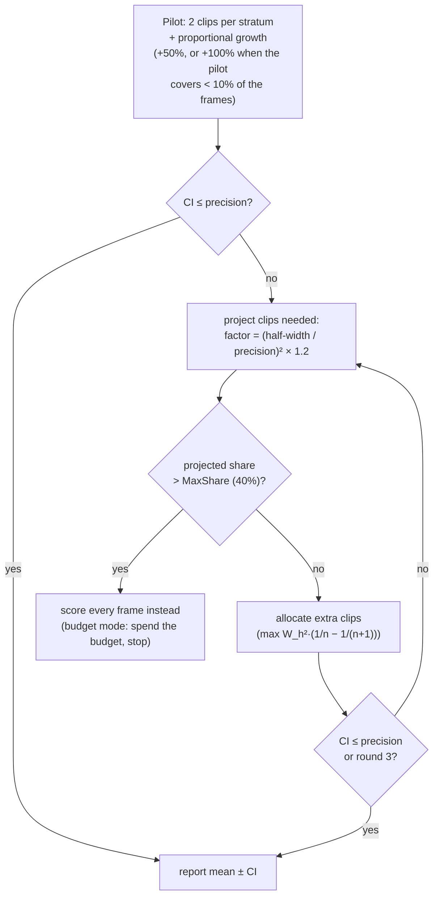
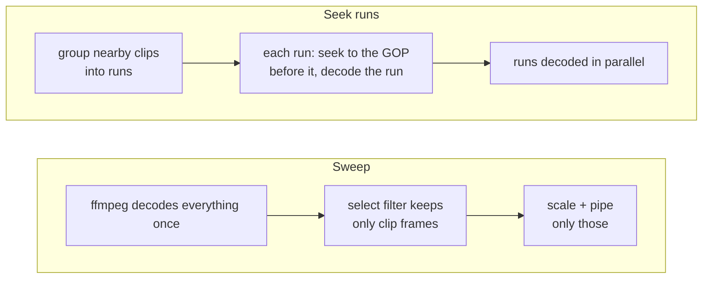

# VMAF engine

`qc vmaf reference distorted` measures VMAF with libvmaf. In **exact** mode
every frame is scored, bit-exact with Netflix's `vmaf` tool (checked on 300
frames at 8 and 10 bits, maximum difference 0.000000). In **sampled** mode
(the default) short clips are scored until the 95% confidence interval of the
mean is narrower than `--precision` (default ±0.5). With a **fixed budget**
(`--sample 5%`, `--sample 2/scene`) you pick the volume instead: the clips are
scored in one round and the report gives the interval they reach (see
[fixed budgets](#fixed-budgets---sample)).

The same frames also feed other metrics (XPSNR, CAMBI, PSNR, PSNR-HVS, SSIM,
MS-SSIM, CIEDE2000) and the VMAF of other viewing devices, each reported with
its own interval: see [section 5](#5-other-metrics-and-devices). HDR (PQ,
HLG) references also get wPSNR and ΔE ITP, and VMAF is labelled as not
HDR-calibrated or scored on an SDR tone mapping (`--hdr-metric`): see
[HDR references](#hdr-references) and [hdr.md](hdr.md).

## 1. Scoring setup

### Model and resolution (`vmaf.ResolveModel`)

| Situation | Model | Evaluation resolution |
|---|---|---|
| default, source ≤ 1080p, ≤ 30 fps | `vmaf_v1.0.16_3d0h` | 1920×1080 |
| source above 1080p | `vmaf_v1.0.16_3d0h_2160` | 3840×2160 |
| above 30 fps | `vmaf_v1.0.16_hfr_3d0h[_2160]` | as above |
| `--model name`, a `.json` path or a built-in version (`vmaf_v0.6.1`) | as given | 4K models at 2160p, others at 1080p |

VMAF v1 models use four features (`cambi`, `speed_chroma_uv`, `adm3`,
`motion3`): VIF, the most expensive v0 feature, is gone, and NEG (no
enhancement gain) is built in. They need libvmaf ≥ 3.2.1; 3.2.0 cannot load
`speed_chroma` without float features.

Both videos are scaled to the evaluation resolution by ffmpeg (bicubic) and
converted to 4:2:0. VMAF must be computed at the display resolution the model
was trained for: scoring a 720p rendition at 720p inflates its score (95.9
instead of 88.2 on the test clip). Frame rates must match.

### Bit depth

Frames are scored at 10 bits when either video has more than 8 bits
(`--vmaf-bit-depth` overrides). Netflix recommends 10-bit input for v1 so that
CAMBI sees banding. In that case ffmpeg outputs `yuv420p10le`, frames carry
16-bit samples, and pictures are handed to libvmaf with `bpc = 10`. The
scale filter converts neither range, matrix, primaries nor transfer (YUV to
YUV): PQ and HLG code values reach libvmaf untouched (bit-exact with a plain
decode at the same size), unless `--hdr-metric tonemap` asks for an SDR
tone mapping.

### The binding (`vmaf`)

Each frame pair is copied into libvmaf-owned pictures in **one cgo call per
picture** (a small C helper copies the three planes row by row, honouring
strides in bytes). `vmaf_read_pictures` then runs the feature extractors on
libvmaf's thread pool. After a flush, `vmaf_score_at_index` returns the
per-frame scores. Each scorer is one `VmafContext` holding one contiguous
sequence of frames. Binaries built with `-tags cuda` can extract the model
features on an NVIDIA GPU instead (`--vmaf-backend`), for VMAF v0.6.1-family
models only: see [VMAF on CUDA](gpu.md#vmaf-on-cuda).

## 2. Sampled measurement

### Why sampling works, and why it is subtle

VMAF is expensive (~90 ms of CPU per 1080p frame with v1 on Apple Silicon,
where CAMBI and chroma features lack NEON code), while the mean over a title is
very stable. The difficulty is not getting close to the mean but **knowing how
close**: a naive interval can look fine on one run and be wrong a third of the
time. Every design choice below was kept only if replaying it thousands of
times on exact per-frame scores showed **~95% real coverage** (see
[validation](validation.md)).

### Clips and warm-up frames

The sampling unit is a **clip of 4 consecutive frames**, not a frame.
Neighbouring frames are strongly correlated, so the variance is computed over
clip means.

Temporal features (motion) need real neighbours. Each clip is decoded with
**one warm-up frame before and one after**, whose scores are dropped. With
them, clip scores are identical to an exact run (0.000 difference measured).
Without the trailing frame, errors reach 1.9 VMAF points.

### Strata: shots for free

The timeline is split into **strata**, so that each stratum is sampled
separately. Frames inside a stratum should look alike. Detecting shots would
require a full decode, but encoders already did it: **keyframes of the
distorted stream sit at scene cuts**. Strata are therefore built from the
GOPs of the distorted bitstream, at zero cost:

- target stratum length = n / (InitialClips / 2) frames, with
  InitialClips = 120, so the pilot below scores ~120 clips;
- consecutive GOPs are grouped until a stratum reaches the target; GOPs longer
  than twice the target are split evenly; strata shorter than two clips are
  merged into their predecessor;
- each stratum is cut into clip slots of 4 frames, the last slot taking the
  remainder.

On real content, stratifying by GOP halved the error at equal cost compared
with fixed-length time strata. On a synthetic 6-shot clip, stratifying by shot
divided the error by ~10 compared with uniform sampling.

### Estimator

With W_h the share of frames in stratum h, n_h sampled clips out of M_h slots
and ȳ_h the mean of its clip means, weighted by clip length (the last slot of a
stratum takes the remainder, so a fully sampled stratum gives exactly its frame
mean):

```
Ȳ       = Σ_h W_h · ȳ_h
Var(Ȳ)  = s_p² · Σ_h W_h² · (1 − n_h/M_h) / n_h
CI      = Ȳ ± t_{0.975, df} · √Var(Ȳ)
```

- **s_p²** is the within-stratum variance of clip means **pooled over all
  strata** (df = Σ(n_h − 1)). Variances estimated stratum by stratum from two
  or three clips were tried first. They are so noisy that intervals came out
  too narrow whenever a draw happened to be low: 68–88% real coverage. The
  pooled variance restored ~95%.
- `(1 − n_h/M_h)` is the finite population correction: a fully sampled
  stratum has no sampling error.
- The Student quantile is exact for df ≤ 2 and uses a Cornish-Fisher expansion
  above (error < 1e-3). The normal quantile uses Acklam's algorithm.

### Two-stage design (Stein)

Stopping as soon as the interval *looks* narrow enough biases the result:
runs stop precisely when the variance happened to be underestimated. The
sampler therefore follows a two-stage design:



- The pilot's **2 clips per stratum** measure the within-stratum variance.
  Because the variance is pooled, the allocation of the second stage is
  proportional to stratum sizes and does not depend on the pilot results. Its
  minimum part therefore **joins the first decoding pass**, and most
  measurements decode the video only once.
- On long videos (pilot < 10% of frames) the first pass is made larger:
  scoring a few more clips costs far less than a second full decode.
- When reaching the precision would need more than `MaxShare` (40%) of the
  frames, sampling costs more than it saves. Every frame is scored instead,
  and the report explains the fallback. The ladder uses a **budget mode**
  instead: it spends the remaining budget and reports the interval reached.
- Clip positions are drawn without replacement in a seeded random order, so
  runs are reproducible.

Frame percentiles (min, p5) in sampled mode only cover the scored frames and
can miss isolated bad frames. Use `--exact` for quality gates.

### Fixed budgets (`--sample`)

The precision loop decides how many clips to score. A fixed budget decides it
up front: its clips are drawn at once and scored in **one round**, usually in
one decoding pass. The report gives the interval that volume reaches
(mean ± half-width, 95%), with mode `sampled` and a `sample` object: the
budget, the clips scored, what the scenes follow, the variance estimator and
any clamping. There is no stopping rule and no fallback to exact scoring.
`--precision` and `--max-share` do not apply, and `--sample` rejects `--exact`
and an explicit `--precision`.

| `--sample` | Clips | Strata | Variance of the mean |
|---|---|---|---|
| `5%` (a share of the frames) | ⌈share · frames / 4⌉, at least 4 | GOPs grouped so that the budget holds 2 clips per stratum; the clips left are given in proportion to stratum sizes | pooled within strata ([estimator](#estimator)) |
| `2/scene` (N ≥ 2 per scene) | N in every scene | one stratum per scene, never grouped | each scene's own |
| `1/scene` | 1 in every scene | one stratum per scene | collapsed strata |

**Scenes.** Scene boundaries are the keyframes of the distorted stream, as for
the strata above. In `qc run`, the frame analysis of the same file runs before
VMAF: its detected shot cuts are added to the keyframes (`boundaries:
"shots+keyframes"`). `qc vmaf` has no frame analysis and uses keyframes only.
Both kinds of boundaries are kept, for two reasons:

- A shot detector misses gradual transitions that encoders often mark with a
  keyframe. On the drama title, a single missed cut merged two scenes into
  one stratum, and the per-scene coverage fell from 94% to 92.5%.
- Keyframes forced by the maximum GOP length split long shots, which brings
  the allocation closer to proportional.

Replays measured the union below the error of either alone (cartoon,
2/scene: RMSE 0.118 against 0.124 for keyframes only and 0.157 for shots
only). Keyframes are a good proxy for scenes when the encoder places them at
cuts (x264, x265 and SVT-AV1 do by default). Fixed-GOP streaming encodes
(a keyframe every 2 s whatever the content) cut GOPs regardless of scenes.
Without shot cuts, `N/scene` then means N clips per GOP.

**Variance estimators.**

- *Share budgets* keep the pooled within-stratum variance of the precision
  loop: their strata are GOP groups of similar lengths, so their
  within-stratum variances are alike.
- *Two or more clips per scene* use each scene's own variance, the textbook
  stratified estimator `Var(Ȳ) = Σ W_h² (1 − n_h/M_h) s_h² / n_h`, with
  Satterthwaite's degrees of freedom. Scenes are never grouped and their
  lengths span two orders of magnitude. Long scenes vary more and weigh more,
  which a pooled variance underestimates (88–91% real coverage on shot
  strata, against 92–96% for separate variances). Per-stratum variances
  failed in the precision loop because it stops on a low draw. A fixed design
  over hundreds of scenes averages their noise out.
- *One clip per scene* leaves no within-scene variance to estimate. Adjacent
  scenes are **collapsed** into pairs, and a triple closes an odd count
  (Cochran, *Sampling Techniques*, §5A.12, after Hansen, Hurwitz and Madow).
  The spread of the scene means within a pair stands for their sampling
  variance:

  ```
  v = Σ_groups G/(G−1) · Σ_k (1 − f_k) W_k² (ȳ_k − ȳ_w)²      df = Σ (G − 1)
  ```

  with ȳ_w the W-weighted mean of the group. For a pair this is
  4 (W₁W₂/(W₁+W₂))² (ȳ₁ − ȳ₂)². The true difference between neighbouring
  scenes adds to it, so the estimator is **conservative**: 98.5–100% real
  coverage, with intervals 2.5–3.4 times the actual RMSE. Neighbours in time
  are paired because they are the likeliest to look alike, and fully sampled
  scenes are left out.

**Clamping.** A budget is adapted to the video, and the report says how
(`sample.clamped`):

- a share above the video (e.g. `100%`) scores every clip, and the interval is
  then empty;
- a share smaller than 4 clips is raised to 4, the fewest that estimate a
  variance;
- a scene with fewer clip slots than asked gives all of them;
- `1/scene` on a video with a single scene (a single GOP) scores 2 clips.

The other metrics and devices are estimated from the same clips, with the
estimator of the budget.

**Which mode?**

| Need | Mode |
|---|---|
| A guaranteed ± on the mean | `--precision` (default): the loop stops once the interval is narrow enough |
| A known cost, e.g. comparing many encodes at equal time | `--sample 5%`: the interval scales with the title's variability (±0.47 on the cartoon, ±1.2 on the 1-minute drama) |
| Every scene looked at, e.g. before inspecting the worst ones | `--sample 2/scene` (honest interval) or `1/scene` (fastest, conservative interval) |
| A quality gate or isolated bad frames | `--exact` |

On short titles a small share gives few clips and wide intervals: 1% of a
1-minute title is 4 clips (±4.6). Scene budgets grow with the number of
scenes, not with the duration.

## 3. Decoding plans

Scoring a few percent of the frames only pays off if decoding does not
dominate. For each round, two plans are costed, in decoded frames on both
sides:



- **Sweep**: each side is decoded once, sequentially. ffmpeg's `select`
  filter drops unselected frames *before* scaling and piping, so only clip
  frames are upscaled and copied. The selection expression is built as a tree
  of parenthesised sums of at most 50 terms, because ffmpeg rejects sum chains
  of more than 100 terms.
- **Seek runs**: clips closer than the cost of a new seek are merged into
  runs. Each run is decoded by its own ffmpeg pair, starting one GOP before
  it, and several runs are decoded in parallel. The run cost counts frames
  decoded from the keyframe, the run itself and a fixed start cost of 12
  frames.
- The seek plan is chosen when it decodes < 90% of the sweep's frames. Its
  parallelism more than pays for the extra process starts (−12% wall time on a
  10-minute title). Dense clips (short videos) always merge into a single run,
  and the sweep wins.

Two decoder subtleties, both found by comparing against exact scores:

- **Open GOPs.** Seeking just before a keyframe of an open GOP makes ffmpeg
  start at that keyframe. Its leading pictures (displayed before it, decoded
  after it, referencing the previous GOP) are then lost, and a whole clip
  becomes misaligned (scores off by ~78 points). Runs therefore start
  decoding 4 frames before the previous keyframe of both streams, i.e. in the
  previous GOP.
- **`-frames:v` counts output frames**, i.e. frames after `select`. A run is
  bounded by its number of *selected* frames, not by its window length;
  otherwise ffmpeg decodes to the end of the file.

Inside a pass, a dispatcher zips the reference and distorted frame streams and
hands each pair to every clip whose warm range contains it (consecutive clips
may share warm-up frames). A clip is queued to a libvmaf worker when its first
frame arrives. At most 2 × workers clips are in flight, and each has a buffer
of 8 pairs, which keeps memory bounded (an exact run on the CPU is a single
clip spanning the whole video).

### Hardware decoding

On macOS (`--hwaccel auto`, the default, or `videotoolbox`), both videos
are decoded by VideoToolbox when it decodes them exactly (H.264 and HEVC,
4:2:0, 8 or 10 bits): a session uses almost no CPU, which libvmaf gets
instead, and concurrent sessions add up while a single one decodes slower
than ffmpeg's CPU decoder (~200 fps for a 1080p title at 25 Mbit/s against
~600). Every decode of a measurement is therefore one of several at once:

- **Seek runs** decode both sides in VideoToolbox sessions, one run per
  two CPUs at once (six on an M2 Max). The sessions (`decode.WithVideoToolboxSessions`, one per CPU:
  twelve on an M2 Max) are shared by both sides; a decode finding them all
  busy runs on the CPU, with identical frames.
- **A sweep** is split into runs of consecutive clips covering equal parts
  of the video, three per worker and at least 500 frames each, decoded
  concurrently from the keyframe before them like seek runs. Only the clip
  frames are piped, as in the sweep.
- **Exact measurements** are scored in **segments**: the video is split at
  keyframes of the distorted stream (three segments per worker, at least
  500 frames each), three segments are scored at once, each on its own
  libvmaf context with a third of the CPUs as threads, and their per-frame
  values are joined in order (plan `segments` in the report). Each segment
  has two warm-up frames before it and one after, dropped: motion (VMAF)
  compares a frame with its predecessor and its successor, XPSNR with one
  predecessor below 32 fps and two above. Every frame then scores exactly
  as in a single pass.

The frames are those of a CPU decode: H.264 and HEVC decoding is bit-exact
by specification, and the downloaded NV12/P010 frames go through the same
bicubic scale filter (hashes compared: 1080p pass-through and 720p to 1080p
and 2160p at 8 bits, 8-bit sources scored at 10 bits, 10-bit HEVC at 1080p
and 720p to 1080p, PQ tone mapped to SDR). Measurements are identical to a
CPU run, frame by frame and series by series (see
[validation](validation.md#exactness)), and the report gives
`hwaccel: "videotoolbox"`. Other codecs, other systems and `--hwaccel none`
keep the CPU plans: one sweep, and a single libvmaf context using every CPU
for an exact measurement.

Runs and segments seek to the timestamp of their first frame on each
video's container timeline (its first frame's timestamp plus the frame's,
`decode.Request.Origin`): ffmpeg would otherwise count from the container's
start, and a video starting after its audio would have every run start one
frame early.

## 4. Results

`qc vmaf` with the default metrics (`xpsnr,cambi,psnr`) on an otherwise idle
M2 Max, VideoToolbox decoding (the default on macOS) and the CPU
(`--hwaccel none`, the only decoder elsewhere, and qc before VideoToolbox
decoding):

| Content | Exact | Sampled (±0.5) | Frames scored | Real CI coverage |
|---|---|---|---|---|
| Drama, 1 min, 1080p25 → x264 720p | 13.0 s (CPU: 14.1 s) | 7.2 s (8.5 s) | 36% | 95.7% |
| Cartoon, 10:36, 1080p25 → x264 720p | 131 s (149 s) | 18.6 s (26.5 s) | 5% | 94.5% |
| 59 min (the cartoon six times), 26 → 6 Mbit/s x264 1080p | 704 s (897 s) | 42.1 s (58.7 s) | 1% | — |

Short titles gain little: guaranteeing ±0.5 needs about a third of their
clips. Long titles are where sampling shines, because the needed number of
clips barely grows with duration.

Fixed budgets on the same titles: VMAF time of `qc vmaf` with the default
metrics, one run each, measured back to back next to a heavy concurrent
workload (load average 60–80). Absolute times are 30–65% above the idle
figures of the table above, but the comparison between modes holds.

| Content | Mode | Frames scored | Decoding | VMAF time | Result |
|---|---|---|---|---|---|
| Drama 1 min | ±0.5 (precision) | 36% | sweep | 13.7 s | ±0.27 |
| Drama 1 min | 2% | 2.1% | seek runs | 2.3 s | ±1.49 |
| Drama 1 min | 5% | 5.1% | seek runs | 4.8 s | ±1.58 |
| Drama 1 min | 10% | 10.1% | sweep | 8.9 s | ±0.75 |
| Drama 1 min | 1/scene | 10.3% | sweep | 9.4 s | ±0.88 |
| Drama 1 min | 2/scene | 20.9% | sweep | 10.5 s | ±0.37 |
| Cartoon 10:36 | ±0.5 (precision) | 5.2% | seek runs | 39.5 s | ±0.49 |
| Cartoon 10:36 | 1% | 1.0% | seek runs | 9.5 s | ±1.37 |
| Cartoon 10:36 | 2% | 2.0% | seek runs | 19.3 s | ±0.79 |
| Cartoon 10:36 | 5% | 5.1% | seek runs | 41.9 s | ±0.46 |
| Cartoon 10:36 | 1/scene | 6.2% | sweep | 60.7 s | ±0.41 |
| Cartoon 10:36 | 2/scene | 12.5% | sweep | 63.4 s | ±0.23 |

- Time follows the frames scored. A budget is faster than the precision loop
  only when it asks for fewer frames than the precision needs: 1–2% of a
  long title in a quarter to a half of the time, or 5% of a short one, where
  ±0.5 needs a third of the frames.
- On long titles, a share budget as large as the loop's first pass costs the
  same (5%: 41.9 s against 39.5 s) and reaches the same interval.
- Per-scene budgets touch every GOP, so they decode the whole title in one
  sweep. On the 10-minute cartoon, 1/scene costs 1.5 times the precision
  loop for a similar interval. It pays off when every scene must be seen, and
  2/scene then halves the interval for almost nothing more.

### Performance

Where the time goes, per 1080p frame pair, on an M2 Max (8 performance and
4 efficiency cores), `vmaf_v1.0.16_3d0h`, x264 720p rendition of a 1080p
H.264 title at 25 Mbit/s:

| Step | CPU | Notes |
|---|---|---|
| libvmaf, VMAF v1 | 61 ms on one core | `speed_chroma` 25.5 ms (42%), ADM 21 ms (35%), CAMBI 13 ms (22%), motion 1 ms; no NEON code but ADM's wavelet and motion |
| libvmaf, 12 threads | 75 ms (efficiency cores count double) | **147 fps at most**: every thread works on its own frame, scaling is near-perfect |
| PSNR (libvmaf) | 1.4 ms | |
| XPSNR (Go) | 5.5 ms → 1.5 ms | NEON row loops, identical integers; 5.7 → 1.7 ms at 10 bits. Above 2048×1152 its 2×2 downsampled activity keeps the portable loops (2160p: 28 → 23.5 ms) |
| Reference decode, CPU | 13.3 ms | ~600 fps with every core |
| Reference decode, VideoToolbox | 3.2 ms | download and conversion; ~200 fps per session |
| Distorted decode + bicubic 720p → 1080p, CPU / VideoToolbox | 5.0 / 3.0 ms | the scale stays on the CPU (bit-exactness) |

- **Exact measurements are bound by libvmaf's CPU.** Before, the whole
  measurement cost ~100 ms of CPU per frame, 107 fps; decoding with
  VideoToolbox and XPSNR in NEON bring it to ~88 ms, 121 fps (cartoon: 149 →
  131 s), 82% of libvmaf's own ceiling. The 59-minute title gains more,
  897 → 704 s: its 26 Mbit/s reference costs more to decode, and its 1080p
  rendition needs no upscaling. The rest is XPSNR, ffmpeg's
  download and scaling, and the tail of the last segments. Going several
  times faster would take cheaper VMAF features, i.e. NEON code in
  libvmaf's `speed_chroma` (its `vif_filter1d` float filter is the hottest
  loop of the whole measurement), ADM and CAMBI.
- **Sampled measurements are bound by decoding.** A seek run decodes from
  the keyframe before the GOP preceding its first clip (open GOPs): on the
  cartoon, the ±0.5 measurement decodes ~26 000 frames on both sides to
  score 822. On the CPU they cost two thirds of its 294 s of CPU; with
  VideoToolbox the CPU drops to 129 s and the media engine sets the pace:
  twelve sessions decode ~1 050 fps of short 1080p runs, ~1 900 of 720p.
  26.5 → 18.6 s on the cartoon, 58.7 → 42.1 s at ±0.5 and 184 → 108 s at
  5% on the 59-minute title.

| Content | Mode | CPU decoding | VideoToolbox | CPU time |
|---|---|---|---|---|
| Drama 1 min | exact | 14.1 s | 13.0 s | 157 → 133 s |
| Drama 1 min | ±0.5 | 8.5 s | 7.2 s | 93 → 70 s |
| Drama 1 min | 5% | 3.0 s | 2.5 s | 29 → 12 s |
| Cartoon 10:36 | exact | 149 s | 131 s | 1 616 → 1 399 s |
| Cartoon 10:36 | ±0.5 | 26.5 s | 18.6 s | 294 → 129 s |
| Cartoon 10:36 | 5% | 26.5 s | 18.6 s | 294 → 127 s |
| Cartoon 10:36 | 2/scene | 42.1 s | 28.9 s | 469 → 276 s |
| 59 min | exact | 897 s | 704 s | 9 072 → 7 572 s |
| 59 min | ±0.5 | 58.7 s | 42.1 s | 613 → 190 s |
| 59 min | 1% | 56.7 s | 39.0 s | 572 → 180 s |
| 59 min | 5% | 184 s | 108 s | 1 907 → 718 s |

Every measurement of the table is identical to the CPU one: same clips,
same per-frame values of every series, same means and intervals.

Levers measured that did not pay, or not enough to keep:

- Segments scored two, three or four at once, and four to six libvmaf
  threads per segment: within the noise (±3%) at 1080p. Three at once keep
  enough sessions per side when decoding is slower than scoring (a 4K
  reference scored with the 1080p model: 17.1 s on the CPU, 15.4 s with a
  single session per side, 14.4 s in segments).
- More seek runs at once (eight to sixteen), more VideoToolbox sessions
  (24, 32), or the distorted side on the CPU to leave the media engine to
  the reference: 0 to 8% on the cartoon, within the noise.
- Seeking four frames before a run instead of into the GOP before it
  decodes a third fewer frames but is no faster (more, shorter runs), and
  it is wrong: after a non-IDR keyframe of a broadcast H.264 stream, the
  decoder drops frames whose references precede it, and a clip scored the
  wrong frames.
- A pool of libvmaf pictures instead of one allocation per frame: no
  measurable change (macOS reuses the memory).
- Unix sockets instead of pipes were already in place for every decode.

## 5. Other metrics and devices

VMAF is one opinion. The frames it decodes, scaled to the evaluation
resolution, are worth more: `--metrics` measures other metrics on exactly
those frames (the sampled clips with their warm-up frames, or every frame),
without decoding anything again.

| `--metrics` | Series reported | Computed by | CPU per 1080p frame (share of VMAF v1) |
|---|---|---|---|
| `cambi` | `cambi` | libvmaf, **the extractor VMAF v1 already runs** | 0 (shared) |
| `xpsnr` | `xpsnr_y`, `xpsnr_u`, `xpsnr_v` | Go port of ffmpeg's `vf_xpsnr.c` (NEON loops on arm64) | 1.5 ms (2%) |
| `psnr` | `psnr_y`, `psnr_cb`, `psnr_cr`, `psnr_yuv` | libvmaf `psnr` | 1.4 ms (2%) |
| `ssim` | `ssim` | libvmaf `float_ssim` | 15 ms (25%) |
| `psnr-hvs` | `psnr_hvs` | libvmaf `psnr_hvs` | 48 ms (75%) |
| `ms-ssim` | `ms_ssim` | libvmaf `float_ms_ssim` | 260 ms (4×) |
| `ciede2000` | `ciede2000` | libvmaf `ciede` | 620 ms (9×) |
| `--devices phone` | `vmaf_phone` | a second model in the same context | 41 ms (65%) |
| automatic on PQ references | `wpsnr_y`, `wpsnr_cb`, `wpsnr_cr` | Go (`quality/hdr`), JVET HDR CTC | 2–4 ms |
| automatic on PQ and HLG references | `deltae_itp`, `deltae_itp_p99` | Go (`quality/hdr`), ITU-R BT.2124 | 4–6 ms |

Costs are single-thread CPU time on an M2 Max, 8-bit frames, next to VMAF v1
(`vmaf_v1.0.16_3d0h`: 63 ms per frame). The default is `xpsnr,cambi,psnr`:
about 5% of VMAF's CPU (12% before XPSNR's NEON loops), and no measurable
change of the wall time of a sampled measurement since libvmaf's workers
stay the bottleneck. PSNR-HVS, MS-SSIM and
CIEDE2000 have no SIMD code on Apple Silicon: they are opt-in
(`--av2-ctc`).

### Same clips, same estimator

Every series is pooled like VMAF: its per-frame values are averaged per clip,
and the stratified estimator of [section 2](#estimator) runs on those clip
means, with the same strata, the same clips and the pooled variance. In exact
mode the mean is over every frame. Per-frame values are in the JSON report
(`frames[].metrics`), and in sampled mode they are bit-identical to the ones
of an exact run on the same frames (checked on every scored frame of the
drama title: difference 0 for every series).

**VMAF alone drives the sampling**: the pilot, the second stage and the
fallback to exact scoring are decided on the primary VMAF's variance. The
other series get no precision target: their interval is whatever the clips
give. Replays show those intervals are honest to within a few points (92–95%
real coverage at 95%, [validation](validation.md#other-metrics-and-devices)):
use `--exact` when a metric other than VMAF must be exact.

### XPSNR

XPSNR (Fraunhofer HHI) weights the squared error of each block by the
inverse of its spatial and temporal activity on the reference, which brings
PSNR close to VMAF on subjective data at a fraction of its cost. The Go
implementation follows ffmpeg's filter operation for operation: block size
scaled from 128 at UHD, 3×3 high-pass at full resolution up to 2048×1152 and
on 2×2 groups above it, first-order temporal differences below 32 fps and
second-order above, min-smoothed weights up to 640×480, integer rounding of
the weighted sums. It matches `ffmpeg -lavfi "[ref][dist]xpsnr"` on the same
frames to 2·10⁻⁶ dB (the precision ffmpeg prints). Note that ffmpeg measures
activity on its **first** input: the reference must come first.

- **Pooling**: like ffmpeg, the sequence value is computed from the mean of
  the per-frame distortions √WSSE, not from the mean of the per-frame dB
  values. The sampler estimates that mean distortion and its interval, then
  converts both bounds (the interval is slightly asymmetric in dB).
- **Temporal activity in clips**: ffmpeg's first frame has a black history.
  A clip starting mid-video is primed with its warm-up frame instead, so its
  frames get exactly the values of an exact run below 32 fps. Above 32 fps
  the second-order difference of the first clip frame lacks one frame of
  history and is approximated.
- Identical frames (infinite XPSNR) are capped at 100 dB so that means stay
  finite.
- Blocks are measured in parallel (row bands), sums are accumulated in raster
  order afterwards so that results do not depend on the number of goroutines.

### Banding (CAMBI)

CAMBI is registered with the options of the VMAF v1 models (1080p speed-up,
visibility luminance threshold 0.06, clipped at 17), so that libvmaf shares
the extractor with a v1 model: banding is free. With another model it is
computed separately (14 ms per 1080p frame, a fifth of VMAF v1). Netflix
considers banding visible above 5:

- the report gives CAMBI's mean with its interval and the 95th percentile of
  the scored frames;
- **banded segments** are runs of scored frames above 5, joined when less
  than a second apart; a clean scored frame ends a segment. They are listed
  as findings (terminal) and charted (HTML). In sampled mode they only cover
  the scored clips: use `--exact` to find every banded frame.
- CAMBI needs 10-bit frames to see banding in 10-bit sources: frames are
  scored at 10 bits when either video has more than 8 (section 1).

### PSNR, PSNR-HVS, SSIM, MS-SSIM, CIEDE2000

libvmaf's extractors, run in the libvmaf context of the clip: PSNR per plane
(capped at 60 dB at 8 bits, 72 dB at 10), PSNR-HVS (0.8 Y + 0.1 Cb + 0.1 Cr),
SSIM and MS-SSIM on luma (0–1), and CIEDE2000 as libvmaf reports it,
45 − 20·log10(mean ΔE00), so that higher is better. Infinite values on
identical frames are capped at 100 dB.

**`--av2-ctc`** adds the metric set of the AOM AV2 common test conditions
(arXiv:2605.15800, computed with libvmaf there too): PSNR Y, Cb, Cr and the
weighted **PSNR-YUV with 4:2:0 weights 7/8, 1/16, 1/16 (14:1:1)**, applied
to each frame's dB values, PSNR-HVS, SSIM, MS-SSIM, CIEDE2000, VMAF and CAMBI.

### HDR references

A PQ or HLG reference adds the HDR metrics to every measurement (verified
ladder rungs included, probes excepted): wPSNR per plane (PQ only), the
luma-weighted PSNR of the JVET HDR test conditions, and the mean and
per-frame 99th percentile of ΔE ITP (BT.2124). They cost 7–14 ms per 1080p
frame, 8–16% of libvmaf's CPU; +6% on the wall time of a comparison. The
result says how VMAF was scored (`hdr`: `transfer`, `metric`,
`vmafCalibrated`, `note`): on the HDR signal (`--hdr-metric pq`, the
default, not calibrated for PQ), or on an SDR tone mapping of both videos
(`tonemap`, slower: the HDR metrics then need a second decode of the scored
clips). Formulas, validation and costs: [hdr.md](hdr.md).

### Devices

`--devices phone,tv,4k` scores the VMAF v1 model of each viewing condition:

| Device | Model (above 30 fps: `_hfr_` variant) | Evaluated at |
|---|---|---|
| `phone` | `vmaf_v1.0.16_5d0h` (5 picture heights) | 1920×1080 |
| `tv` | `vmaf_v1.0.16_3d0h` (3 picture heights) | 1920×1080 |
| `4k` | `vmaf_v1.0.16_3d0h_2160` | 3840×2160 |

- Models evaluated at the primary resolution join the primary libvmaf
  context: features with identical options (motion, CAMBI) are extracted
  once, the others (ADM and chroma speed with the phone's viewing distance)
  are extra. Each model is loaded under its own name, since libvmaf stores
  predicted scores by model name.
- Models at another resolution (`4k` for a 1080p primary, `phone`/`tv` for a
  2160p one) need frames scaled differently: a second pass decodes the same
  clips at their resolution. It costs a second decode, a 2160p upscale and a
  4K VMAF: on the drama title, about 2.5 times the CPU of the 1080p
  measurement.
- A device whose model is the primary one reuses its scores.

**The primary VMAF** is the `--model` one (default `auto`: the TV model at
1080p for sources up to 1080p, the 4K model above, HFR variants above
30 fps). It is the model of the display the source was made for, it sets the
evaluation resolution of every other metric, and it alone drives the sampling
and the stopping rule: one variance has to size the sample, and replays show
the device intervals built on the same clips keep ~95% coverage
(94.9–95.9% on the drama and cartoon titles) because device scores are
strongly correlated with the primary.
